# 01 — Introduction to AI Engineering
## From Zero to Expert: Everything You Need to Know

---

## Table of Contents
1. [What is Artificial Intelligence?](#1-what-is-artificial-intelligence)
2. [What is an AI Engineer?](#2-what-is-an-ai-engineer)
3. [AI Engineer vs ML Engineer vs Data Scientist](#3-ai-engineer-vs-ml-engineer-vs-data-scientist)
4. [The AI Engineering Stack](#4-the-ai-engineering-stack)
5. [Core Responsibilities](#5-core-responsibilities)
6. [How AI is Changing Software Development](#6-how-ai-is-changing-software-development)
7. [AI vs AGI — Understanding the Difference](#7-ai-vs-agi)
8. [Career Path and Skills](#8-career-path-and-skills)
9. [The AI Ecosystem Overview](#9-the-ai-ecosystem-overview)
10. [Key Points & Practice Questions](#10-key-points--practice-questions)

---

## 1. What is Artificial Intelligence?

Before we talk about AI Engineering, let's be crystal clear about what AI actually is.

### The Plain English Definition

**Artificial Intelligence (AI)** is software that can perform tasks which normally require human intelligence — things like understanding language, recognising images, making decisions, or writing text.

Think of it like this:

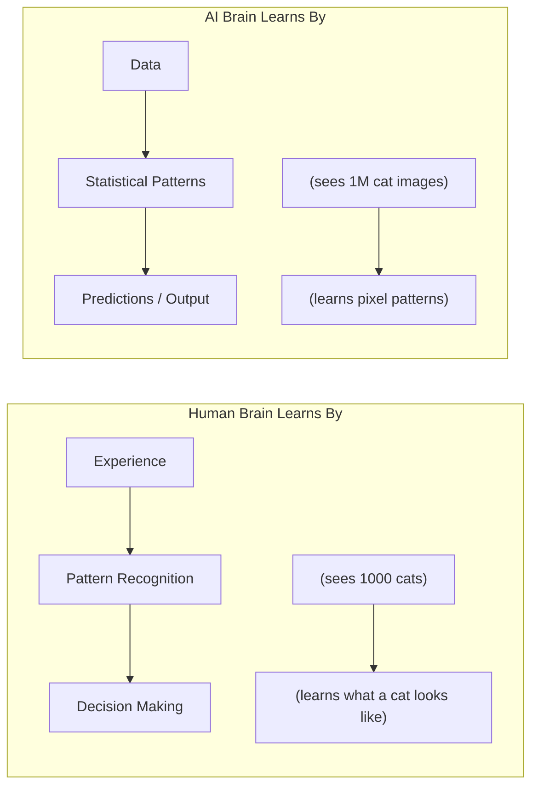

### A Brief History of AI (So You Understand Why Now is Special)

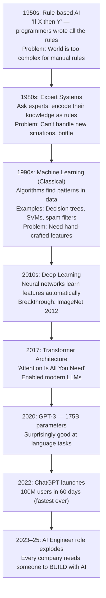

### What Makes Modern AI Different

The key breakthrough is **scale**. Modern AI models are trained on essentially the entire internet — books, code, articles, conversations. This gives them surprisingly broad knowledge and capability.

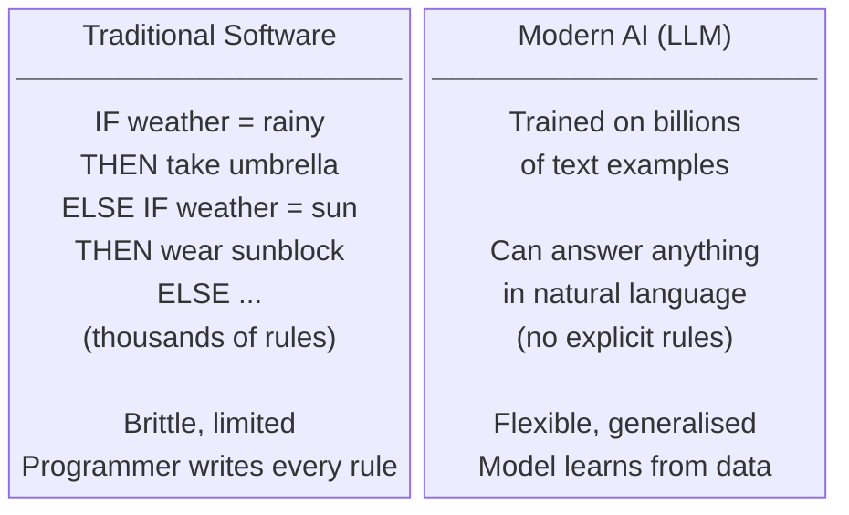

---

## 2. What is an AI Engineer?

### The Simple Analogy

Imagine you need to build a car:

- **Engineer who builds the engine** = ML Researcher/Engineer (creates AI models)
- **Engineer who builds the car using that engine** = AI Engineer (builds apps using AI)

An **AI Engineer** is a software engineer who specialises in building applications, systems, and products that leverage AI models — especially Large Language Models (LLMs).

The key phrase: **using** AI, not **building** AI from scratch.

### What AI Engineers Actually Do Day-to-Day

```
A typical AI Engineer's week might look like:

Monday:   Design a chatbot that answers customer questions
          using company documentation (RAG system)

Tuesday:  Write and test prompts to improve response quality
          Test 10 prompt variations, measure which works best

Wednesday: Build an agent that automatically categorises
           support tickets and routes them to correct teams

Thursday: Debug why the RAG system is giving wrong answers
          Investigate retrieval quality, chunk sizes, prompts

Friday:   Deploy the system to production
          Set up monitoring, logging, cost tracking
```

### The Birth of the AI Engineer Role

Before 2022, building with AI meant knowing PyTorch, CUDA, and spending weeks training models. Then ChatGPT happened.

Suddenly:
- You could call an API and get human-level text generation
- No GPU needed, no training required
- Just Python and an HTTP call

This created a new type of engineer: someone who **orchestrates** AI rather than building it from scratch.

```
Pre-2022:
  To build a language app:
  1. Collect training data (months)
  2. Train a model (weeks, $$$)
  3. Deploy and maintain (ongoing)
  Total: 6+ months, $100K+

Post-2022 (AI Engineer approach):
  To build a language app:
  1. Get API key (minutes, free)
  2. Write prompts and integration (days)
  3. Deploy (hours)
  Total: 1-2 weeks, ~$100/month
```

---

## 3. AI Engineer vs ML Engineer vs Data Scientist

These roles are often confused. Here's a clear breakdown:

### The Library Analogy

Imagine a library system:

```
DATA SCIENTIST:
  Studies which books people want, what topics are popular,
  builds recommendation algorithms using statistics

ML ENGINEER:
  Physically builds the recommendation system — writes the
  training pipeline, optimises the model, deploys it to servers

AI ENGINEER:
  Takes the recommendation system (already built) and integrates
  it into a beautiful app that users actually interact with
```

### Detailed Comparison

| Aspect | AI Engineer | ML Engineer | Data Scientist |
|--------|-------------|-------------|----------------|
| **Core Question** | "How do I build products with AI?" | "How do I train better models?" | "What does this data tell us?" |
| **Uses AI as** | Building blocks (APIs) | Subject of study | One of many tools |
| **Main Work** | System design, integration, prompting | Model architecture, training | Analysis, experimentation |
| **Daily Tools** | APIs, vector DBs, LangChain | PyTorch, CUDA, MLflow | Pandas, Jupyter, SQL |
| **Primary Language** | Python + TypeScript | Python + C++ | Python + R + SQL |
| **Cares About** | Latency, UX, cost, reliability | Loss curves, accuracy, benchmarks | Insights, statistical significance |
| **Output** | Shipped products users interact with | Model weights (.pt files) | Reports, dashboards, models |
| **Background** | Software engineering + AI knowledge | Math/CS + deep learning | Statistics + domain knowledge |
| **Typical Salary (2025)** | $150K-$300K | $180K-$350K | $120K-$220K |

### Who Uses What Tools

```
AI Engineer Toolkit:
  • OpenAI / Anthropic / Google APIs
  • LangChain, LlamaIndex, Haystack
  • Vector databases (Pinecone, Chroma)
  • Prompt management tools
  • Python + FastAPI + React/Next.js

ML Engineer Toolkit:
  • PyTorch, TensorFlow, JAX
  • Hugging Face Transformers
  • CUDA, distributed training
  • MLflow, Weights & Biases
  • Docker, Kubernetes, Ray

Data Scientist Toolkit:
  • Pandas, NumPy, Scikit-learn
  • Jupyter notebooks
  • Matplotlib, Seaborn, Plotly
  • SQL, Spark
  • Statistical testing libraries
```

### Overlap Areas

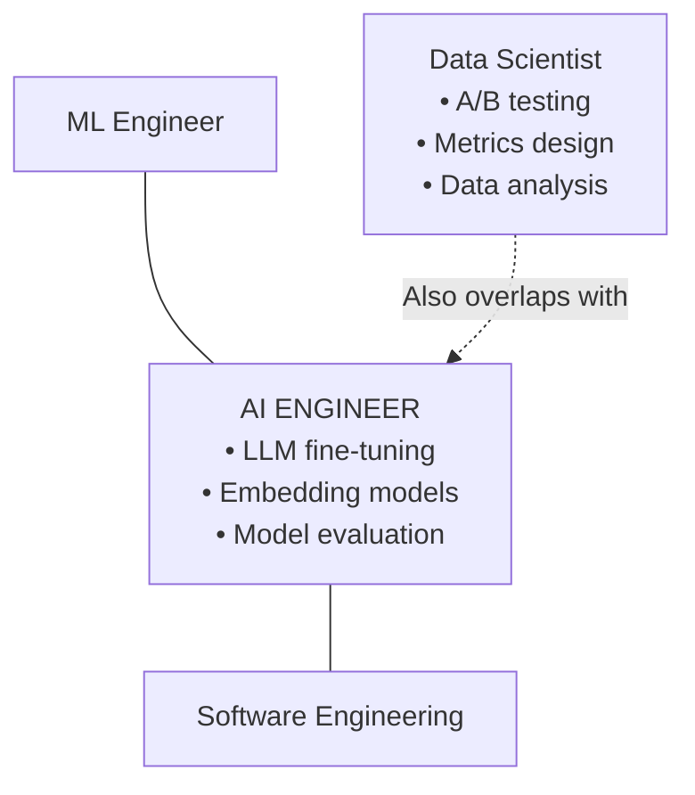

---

## 4. The AI Engineering Stack

Think of building software like building a house. There are different layers:

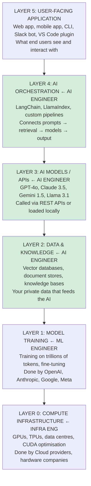

As an AI Engineer, you work primarily with Layers 2, 3, and 4.
You benefit from Layers 0 and 1 but don't build them.

---

## 5. Core Responsibilities

Let's walk through each responsibility in detail with real examples.

### Responsibility 1: Choosing and Integrating AI Models

```
Decision: Which model should we use?

Factors to consider:
  Cost:        GPT-4o-mini costs 20x less than GPT-4o
  Quality:     Different models excel at different tasks
  Speed:       Latency matters for real-time apps
  Context:     How long is your input/output?
  Privacy:     Can you send this data to a cloud API?
  Compliance:  Healthcare/Finance may require on-premise

Example decision:
  Building a customer service chatbot
  → Need: Good language understanding, reasonable cost
  → Choose: GPT-4o-mini (80% quality of GPT-4o, 5% of cost)
  → If it fails quality bar: upgrade to GPT-4o for hard queries
```

### Responsibility 2: Prompt Engineering

```
Prompt engineering = crafting instructions that reliably get
the output you want from an AI model.

Bad prompt:                   Good prompt:
─────────────────────────     ──────────────────────────────────────
"Summarise this text"         "You are a professional summariser.
                               Summarise the following article in
                               exactly 3 bullet points. Each bullet
                               must be a single sentence under 15
                               words. Focus on business impact.

                               Article: [TEXT]"

Bad output:                   Good output:
Three paragraphs of           • Revenue increased 23% due to new
rambling text                   product launch
                              • Customer acquisition costs fell 15%
                              • Q4 outlook raised to $2.1B from $1.9B
```

### Responsibility 3: Building RAG Pipelines

```
RAG = Retrieval-Augmented Generation

The problem:
  Your LLM was trained in 2024. It doesn't know about:
  - Your company's internal documents
  - Events after its training cutoff
  - Private customer data
  - Real-time information

The solution (RAG):
  1. Store your documents in a searchable database
  2. When user asks a question, find relevant documents
  3. Include those documents in the LLM prompt
  4. LLM answers using YOUR data

Real example:
  Company: Insurance provider
  Problem: Agents spend 30 min searching policy documents per call
  Solution: RAG chatbot over all policy PDFs
  Result: Agents get instant accurate answers, calls 60% shorter
```

### Responsibility 4: Building AI Agents

```
An agent is an AI that can DO things, not just answer questions.

Simple LLM (no agent):
  Q: "What are Apple's current stock price and market cap?"
  A: "I can't provide real-time financial data." ❌

Agent with tools:
  Q: "What are Apple's current stock price and market cap?"
  → Agent THINKS: "I need real-time financial data"
  → Agent ACTS: calls financial API tool
  → Agent OBSERVES: "AAPL: $195.80, Market Cap: $3.02T"
  → Agent ANSWERS: "Apple (AAPL) is currently at $195.80
                    with a market cap of $3.02 trillion." ✅
```

### Responsibility 5: Evaluation and Quality Assurance

```
AI outputs are probabilistic — you never know exactly what you'll get.
AI Engineers must constantly measure and improve quality.

Evaluation dimensions:
  Accuracy:      Is the answer correct?
  Faithfulness:  Is the answer based on provided context?
  Relevance:     Does the answer address the question?
  Safety:        Is the answer appropriate/harmless?
  Cost:          How much did this cost per answer?
  Speed:         How long did the answer take?

Example evaluation pipeline:
  1. Create a test set of 100 Q&A pairs (ground truth)
  2. Run your system on all 100 questions
  3. Compare outputs to ground truth
  4. Score: 87/100 correct (87% accuracy)
  5. Examine the 13 failures — patterns?
  6. Fix prompts, chunking, retrieval
  7. Re-run: 94/100 (94% accuracy) ✓
```

### Responsibility 6: Deployment and Production

```
AI app in production means:
  • Users are hitting it 24/7
  • API costs are real money
  • Failures are customer-facing
  • Latency affects user experience
  • Security vulnerabilities are risks

Production checklist for AI apps:
  □ API keys stored in environment variables (never in code)
  □ Rate limiting (prevent abuse, control costs)
  □ Logging (know what's happening)
  □ Error handling (graceful failures, not crashes)
  □ Caching (save money on repeated queries)
  □ Monitoring (alert when things go wrong)
  □ Fallbacks (if OpenAI is down, use Anthropic)
```

---

## 6. How AI is Changing Software Development

### The Shift in Product Development

Traditional product development:
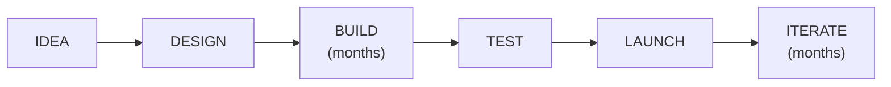

AI-augmented development:
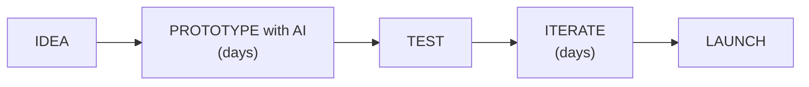

### Concrete Examples of AI in Products

**Before AI:**
```
Customer service: 50 human agents, 8-hour response time
Content: 10 writers producing 20 articles/week
Code review: Takes 2 days for each PR
Search: Returns exact keyword matches only
```

**After AI (AI Engineer builds these):**
```
Customer service: 3 agents + AI chatbot, <1 minute response
Content: 2 writers + AI drafts 200 articles/week
Code review: AI reviews in 2 minutes, humans review exceptions
Search: Semantic search finds meaning, not just keywords
```

### New Product Categories Enabled by AI

```
BEFORE AI ENGINEER ROLE EXISTED:

"AI-powered X" meant expensive, slow, research project

AFTER AI ENGINEER ROLE (2023+):

AI-powered writing assistant  → Launched in 2 weeks
AI-powered code reviewer      → Launched in 1 week
AI-powered knowledge base     → Launched in 3 days
AI-powered customer service   → Launched in 1 week
AI-powered personalisation    → Launched in 2 weeks
```

### The Flywheel Effect

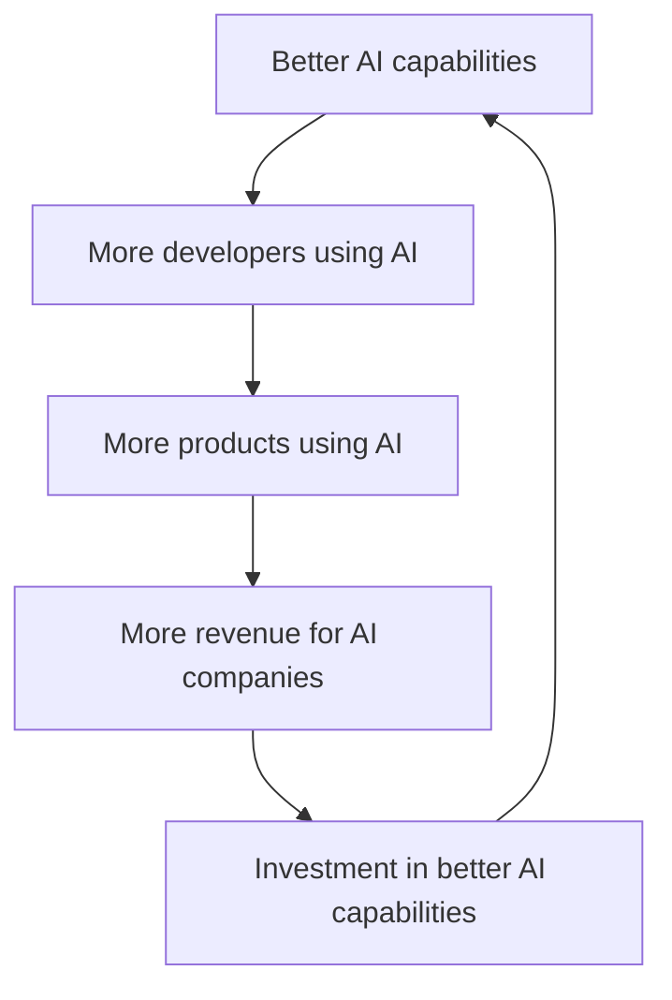

> Note: This flywheel is why AI moves so fast — each loop accelerates the next.

---

## 7. AI vs AGI

This is a fundamentally important concept for any AI engineer to understand.

### Current AI (Narrow AI)

Modern LLMs like GPT-4 and Claude are incredibly impressive, but they are **narrow AI** — they're very good at language tasks but lack true understanding.

```
What current AI IS:
  ✓ A very sophisticated pattern-matching system
  ✓ Trained on vast amounts of text data
  ✓ Can generate plausible-sounding text for almost any topic
  ✓ Useful for many business applications
  ✓ Can do many things that used to require human experts

What current AI IS NOT:
  ✗ Actually "understanding" anything
  ✗ Conscious or self-aware
  ✗ Capable of truly novel reasoning beyond its training
  ✗ Able to learn and update from conversations (by default)
  ✗ Reliable at math without special tools
  ✗ Truly intelligent in the way humans are
```

### The Stochastic Parrot Problem

One analogy: current LLMs are like very sophisticated "stochastic parrots" — they generate statistically likely next words without truly understanding meaning.

```
Example of this limitation:

Q: "If you have 3 sisters and each sister has 1 brother,
    how many brothers do you have in total?"

A typical LLM might say "3 brothers" (one per sister)
Correct answer: 1 brother (you are the one brother)

Why wrong? The model does pattern matching on surface
text, not true logical reasoning.

This is why:
  • Chain of Thought prompting helps (forces step-by-step)
  • o1/o3 models are better (internal reasoning)
  • But even these aren't "true" reasoning
```

### AGI (Artificial General Intelligence)

**AGI** = An AI system that can perform any intellectual task that a human can.

```
Characteristics of AGI (doesn't exist yet):
  • Can learn any new task from scratch like humans
  • Has genuine understanding, not just pattern matching
  • Can reason causally, not just correlatively
  • Can transfer learning freely across domains
  • Can set its own goals
  • Has something like consciousness or self-awareness

Timeline estimates from experts (as of 2025):
  Pessimists:  50-100+ years
  Moderates:   15-30 years
  Optimists:   5-15 years (some say sooner)

Current consensus: We don't know. Progress is faster than expected.
```

### Why This Matters for AI Engineers

```
Because AI is NOT AGI, as an AI engineer you must:

1. NEVER assume the model is always right
   → Always validate critical outputs
   → Use RAG to ground in real data

2. DESIGN for failure
   → AI will give wrong answers
   → Build systems that catch and handle this
   → Have human-in-the-loop for critical decisions

3. UNDERSTAND limitations
   → Bad at math (use code tools)
   → Hallucinates confidently
   → Training data cutoff (use RAG for recent info)
   → Context window limits

4. SET CORRECT EXPECTATIONS
   → AI engineers must educate stakeholders
   → "95% accuracy" is often amazing
   → But "5% errors" can still cause problems
```

---

## 8. Career Path and Skills

### The Skill Tree

Think of learning AI Engineering like a skill tree in a video game:

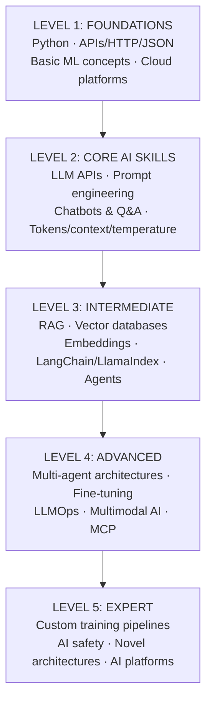

### Technical Skills Deep Dive

**Python (the essential language):**
```python
# You need to be comfortable with:

# 1. Functions, classes, decorators
def process_with_ai(text: str, system_prompt: str) -> str:
    """Always type-hint your functions"""
    ...

# 2. Async programming (AI APIs benefit from async)
import asyncio
async def parallel_ai_calls(texts: list[str]) -> list[str]:
    tasks = [call_ai(t) for t in texts]
    return await asyncio.gather(*tasks)

# 3. Working with APIs (requests, httpx)
import httpx
response = httpx.post("https://api.openai.com/v1/chat/completions",
                       json=payload, headers=headers)

# 4. Environment management
import os
api_key = os.environ.get("OPENAI_API_KEY")  # Never hardcode secrets!

# 5. Data manipulation
import json
data = json.loads(response.text)   # Parse JSON responses

# 6. File handling (for RAG document loading)
from pathlib import Path
for pdf in Path("./docs").glob("*.pdf"):
    process_document(pdf)
```

**TypeScript/JavaScript (for web frontends):**
```typescript
// You need for web AI apps:
// - React for UI
// - Streaming responses
// - EventSource for SSE
// - Fetch API for LLM calls

const response = await fetch('/api/chat', {
  method: 'POST',
  body: JSON.stringify({ message: userInput }),
  headers: { 'Content-Type': 'application/json' }
});
// Stream the response token by token...
```

### Soft Skills That Matter

```
1. PRODUCT THINKING
   "What problem are we actually solving?"
   "Is AI the right tool here?"
   "What's the simplest version that works?"

2. ITERATION MINDSET
   AI development is empirical — you test and iterate
   Prompt A vs Prompt B → which gets better results?
   Small experiment → measure → adjust

3. COMMUNICATION
   Explaining AI to non-technical stakeholders
   "The model is 93% accurate on test set"
   "It will sometimes give wrong answers — here's how we handle that"

4. RISK AWARENESS
   "What happens when this AI gives a wrong answer?"
   "Who is affected if the system fails?"
   "How do we detect failures early?"
```

---

## 9. The AI Ecosystem Overview

### The Major Players (2025)

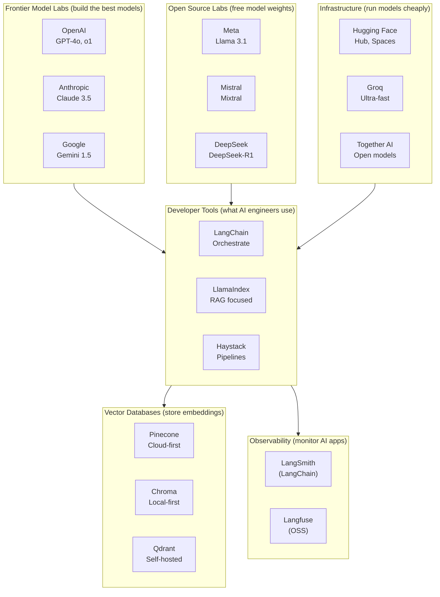

### How These Pieces Connect

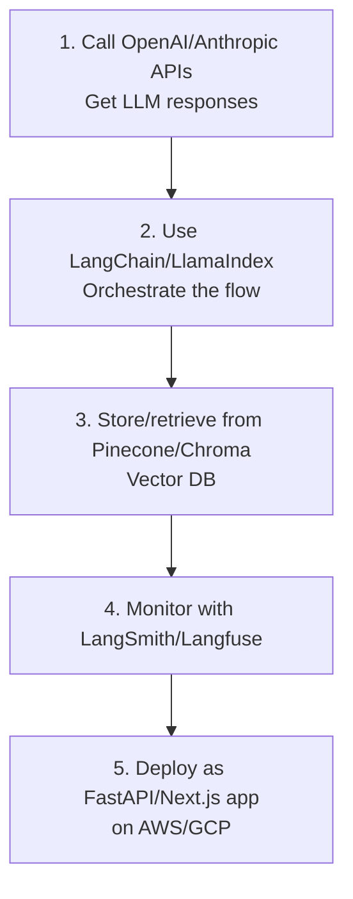

---

## 10. Key Points & Practice Questions

### Exam-Ready Summary

```
┌──────────────────────────────────────────────────────────────────────┐
│                     MASTER REFERENCE CARD                             │
│                                                                      │
│  AI ENGINEER                                                        │
│  • Builds PRODUCTS using pre-trained AI models                      │
│  • Primary skill: Integration, prompting, orchestration             │
│  • Does NOT train models from scratch (usually)                     │
│                                                                      │
│  VS ML ENGINEER                                                     │
│  • Builds and trains the AI MODELS themselves                       │
│  • Primary skill: PyTorch, data pipelines, model architecture       │
│                                                                      │
│  VS DATA SCIENTIST                                                  │
│  • Analyses data to extract insights                                │
│  • Primary skill: Statistics, data analysis, visualisation          │
│                                                                      │
│  THE STACK                                                          │
│  Layer 4: User-facing application (what users see)                  │
│  Layer 3: AI Orchestration (LangChain, etc.)          ← You        │
│  Layer 2: AI Models/APIs (GPT-4, Claude, etc.)        ← You        │
│  Layer 1: Data & Knowledge (vector DBs)               ← You        │
│  Layer 0: Model Training (OpenAI, etc. do this)                    │
│                                                                      │
│  AI vs AGI                                                         │
│  Current AI: Pattern matching, impressive but limited, no AGI      │
│  AGI: True general intelligence, doesn't exist yet                 │
│                                                                      │
│  WHY THIS ROLE NOW                                                  │
│  APIs made AI accessible in 2022 → anyone can build with it        │
│  New category: people who BUILD WITH AI vs BUILD AI                │
└──────────────────────────────────────────────────────────────────────┘
```

### Practice Questions

**Beginner Level:**
1. What is the fundamental difference between an AI Engineer and an ML Engineer?
2. Name three things an AI Engineer does day-to-day.
3. What does AGI stand for and does it exist today?
4. Why did the AI Engineer role become prominent around 2022?
5. What is the "stack" that an AI Engineer typically works with?

**Intermediate Level:**
6. Why should an AI Engineer never assume an LLM output is always correct?
7. Explain the "stochastic parrot" problem in your own words.
8. What skills (both technical and soft) does an AI Engineer need?
9. How has AI changed the time and cost to build certain types of products?
10. What is the difference between "using AI" and "building AI"?

**Advanced Level:**
11. Design a mental model for how you would evaluate whether to use AI for a particular business problem.
12. What are the risks of current LLMs that an AI Engineer must design around?
13. How does the AI ecosystem's "flywheel effect" impact your career as an AI Engineer?
14. What distinguishes a senior AI Engineer from a junior one?
15. In what scenarios would you recommend NOT using an LLM?

---

*Next: [11 — Core Concepts](../11-core-concepts/README.md)*
