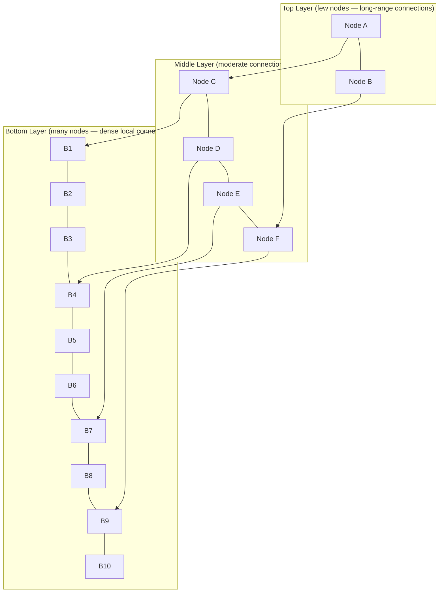

# 08 — Vector Databases: Complete Guide from Concept to Production

**Builds on:** Module 15 (Embeddings) — vector databases store the embedding vectors that Module 15 explains how to create. You need to understand what a vector is (a list of floats representing meaning) before understanding how to store and search them. Module 08 (Word2Vec) introduced the concept that words can be represented as dense vectors in a meaningful geometric space.

**Used by:** Module 17 (RAG) — the retrieval phase of RAG searches a vector database. Understanding HNSW, IVF, and metadata filtering here makes the RAG retrieval section concrete.

---

## 1. Why Regular Databases Can't Do Semantic Search

```
TRADITIONAL DATABASE (SQL/NoSQL):
───────────────────────────────
  "Find documents about dogs"

  SQL: SELECT * FROM docs WHERE text LIKE '%dog%'
       → Only finds documents with EXACT word "dog"
       → Misses: "puppy", "canine", "Labrador", "man's best friend"

  MongoDB: db.docs.find({text: /dog/})
           → Same problem: exact text matching only

VECTOR DATABASE:
────────────────
  "Find documents about dogs"

  1. Embed query: "dogs" → [0.19, -0.07, 0.62, ...]
  2. Find similar vectors in database
  3. Returns: "puppy guide", "canine health", "Labrador care" ✓
     (even though none of them say "dog" exactly!)

The difference: vector DBs search by MEANING, not text.
```

---

## 2. How Vector Databases Work Internally

### The Naive Approach (Too Slow)

```
Brute force search over 1 million vectors:
  For each of 1,000,000 documents:
    compute cosine_similarity(query, document)
  Sort results, return top-5

Cost: 1,000,000 × 1,536 multiplications = 1.5 billion operations
Time: several seconds per query ← UNACCEPTABLE
```

### HNSW (Hierarchical Navigable Small World)

The most popular ANN (Approximate Nearest Neighbor) algorithm used by Pinecone, Weaviate, Qdrant.



> Note: Search starts at the top (fast, coarse), then narrows down layer by layer to the bottom (dense, precise). This gives ~50-100 comparisons instead of 1M — 10,000x faster, with 95-99% accuracy.

---

## 3. Distance Metrics

```
COSINE SIMILARITY (most common for text):
  Measures angle between vectors
  Range: -1 to 1 (1 = identical)
  Use for: text, dense embeddings, general purpose

EUCLIDEAN DISTANCE (L2):
  Measures straight-line distance
  Range: 0 to ∞ (0 = identical)
  Use for: image embeddings, when vector magnitude matters

DOT PRODUCT:
  Fast but sensitive to vector magnitude
  Use for: when embeddings are already normalized (most cases)
  With normalized vectors: dot product = cosine similarity
```

---

## 4. Chroma — Best for Getting Started

**Chroma** is free, open-source, and works in-memory or on disk. Perfect for learning and local projects.

```python
# pip install chromadb openai

import chromadb
from chromadb.utils.embedding_functions import OpenAIEmbeddingFunction
import os

# ── Setup ──
# In-memory (lost when Python exits):
client = chromadb.Client()

# Persistent (saved to disk, reloaded on restart):
client = chromadb.PersistentClient(path="./my_vector_db")

# ── Create a collection with auto-embedding ──
# OpenAIEmbeddingFunction embeds documents automatically!
openai_ef = OpenAIEmbeddingFunction(
    api_key=os.environ["OPENAI_API_KEY"],
    model_name="text-embedding-3-small"
)

collection = client.create_collection(
    name="company_knowledge",
    embedding_function=openai_ef,    # Auto-embeds on add and query
    metadata={"hnsw:space": "cosine"}  # Distance metric
)

# ── Add documents ──
collection.add(
    documents=[
        "Our return policy allows returns within 30 days of purchase.",
        "Free shipping is available on orders over $50.",
        "Customer support hours: Monday-Friday, 9am-6pm EST.",
        "We offer a 2-year warranty on all electronics products.",
    ],
    ids=["doc1", "doc2", "doc3", "doc4"],  # Unique IDs (required)
    metadatas=[                             # Optional metadata for filtering
        {"category": "returns", "source": "policy.pdf"},
        {"category": "shipping", "source": "policy.pdf"},
        {"category": "support",  "source": "faq.pdf"},
        {"category": "warranty", "source": "policy.pdf"},
    ]
)

print(f"Collection has {collection.count()} documents")

# ── Query (semantic search) ──
results = collection.query(
    query_texts=["Can I send back my order?"],
    n_results=2          # Return top-2 most similar
)

for doc, metadata, distance in zip(
    results["documents"][0],
    results["metadatas"][0],
    results["distances"][0]
):
    similarity = 1 - distance   # Convert L2 to approximate similarity
    print(f"Similarity: {similarity:.3f} | Category: {metadata['category']}")
    print(f"  {doc}")

# ── Filter by metadata ──
filtered_results = collection.query(
    query_texts=["product guarantee"],
    n_results=2,
    where={"category": "warranty"}   # Only search warranty docs
)

# ── Update a document ──
collection.update(
    ids=["doc1"],
    documents=["Our return policy allows returns within 60 days."],  # Updated!
)

# ── Delete a document ──
collection.delete(ids=["doc2"])
print(f"Collection now has {collection.count()} documents")

# ── Get a document by ID ──
item = collection.get(ids=["doc1"])
print(item["documents"][0])
```

---

## 5. Pinecone — Best Managed Cloud Option

**Pinecone** is a fully managed vector database in the cloud. Great for production apps without self-hosting.

```python
# pip install pinecone-client

from pinecone import Pinecone, ServerlessSpec
import os
import numpy as np

pc = Pinecone(api_key=os.environ["PINECONE_API_KEY"])

# ── Create index ──
# Only need to do this once
pc.create_index(
    name="my-app-index",
    dimension=1536,          # MUST match your embedding model's output size!
    metric="cosine",         # "cosine", "euclidean", or "dotproduct"
    spec=ServerlessSpec(
        cloud="aws",
        region="us-east-1"   # or "us-west-2", "eu-west-1", etc.
    )
)

# Connect to the index
index = pc.Index("my-app-index")

# ── Upsert vectors ──
# Unlike Chroma, Pinecone requires pre-computed embeddings
# You must embed documents yourself first

from openai import OpenAI
client = OpenAI()

def create_embedding(text: str) -> list[float]:
    response = client.embeddings.create(
        input=[text], model="text-embedding-3-small"
    )
    return response.data[0].embedding

docs = [
    {"id": "doc1", "text": "Return policy: 30 days"},
    {"id": "doc2", "text": "Free shipping over $50"},
    {"id": "doc3", "text": "Support hours: Mon-Fri 9am-6pm"},
]

vectors = []
for doc in docs:
    embedding = create_embedding(doc["text"])
    vectors.append({
        "id":       doc["id"],
        "values":   embedding,          # The embedding vector
        "metadata": {"text": doc["text"], "source": "policy.pdf"}
    })

# Upsert: insert or update (creates if not exists, updates if exists)
index.upsert(vectors=vectors, namespace="company-docs")

# ── Query ──
query_embedding = create_embedding("Can I return something?")

results = index.query(
    vector=query_embedding,
    top_k=3,                     # Return top-3
    include_metadata=True,       # Include the metadata we stored
    namespace="company-docs",    # Optional: search only this namespace
    filter={                     # Optional: filter by metadata
        "source": {"$eq": "policy.pdf"}
    }
)

for match in results["matches"]:
    print(f"Score: {match['score']:.3f} | {match['metadata']['text']}")

# ── Namespaces for multi-tenancy ──
# Different customers → different namespaces → completely isolated data
index.upsert(vectors=vectors, namespace="customer_A_docs")
index.upsert(vectors=vectors, namespace="customer_B_docs")

# Customer A can only search their own namespace
results_a = index.query(
    vector=query_embedding,
    top_k=3,
    namespace="customer_A_docs"   # Completely isolated from customer B
)

# ── Stats ──
stats = index.describe_index_stats()
print(f"Total vectors: {stats.total_vector_count}")
```

---

## 6. FAISS — Facebook AI Similarity Search (Local, Free)

**FAISS** is Facebook's highly optimised ANN library. Very fast, runs locally, no server needed.

```python
# pip install faiss-cpu  (for CPU)
# pip install faiss-gpu  (for NVIDIA GPU - much faster!)

import faiss
import numpy as np
import json

# ── Index types ──

# IndexFlatL2: Exact search, L2 distance
# Use when: Small datasets (<100K), need exact results, high accuracy critical
dimension = 1536  # Must match your embedding model
exact_index = faiss.IndexFlatL2(dimension)

# IndexHNSWFlat: Approximate, fast, HNSW algorithm
# Use when: Most production cases — best balance of speed and accuracy
hnsw_index = faiss.IndexHNSWFlat(dimension, 32)  # 32 connections per node
hnsw_index.hnsw.efConstruction = 40    # Build quality (higher=better/slower)
hnsw_index.hnsw.efSearch = 16          # Search quality (higher=better/slower)

# IndexIVFFlat: Approximate, memory efficient for large datasets
# Use when: Very large datasets (millions of vectors)
quantizer = faiss.IndexFlatL2(dimension)
ivf_index = faiss.IndexIVFFlat(quantizer, dimension, 100)  # 100 clusters

# ── Add vectors ──
# FAISS requires numpy float32 arrays

def add_documents_faiss(index, texts: list[str]) -> list[list[float]]:
    """Add documents to FAISS index, return embeddings for storage."""
    from openai import OpenAI
    client = OpenAI()

    response = client.embeddings.create(input=texts, model="text-embedding-3-small")
    embeddings = [item.embedding for item in response.data]

    # FAISS requires float32 numpy array
    vectors = np.array(embeddings, dtype=np.float32)

    # IVF index requires training before adding
    if hasattr(index, 'train') and not index.is_trained:
        index.train(vectors)   # Learn cluster structure

    index.add(vectors)
    print(f"Index now contains {index.ntotal} vectors")
    return embeddings


# ── FAISS doesn't store text — you need a parallel list ──
texts = [
    "Return policy: 30 days",
    "Free shipping over $50",
    "Support hours: Mon-Fri",
]
embeddings = add_documents_faiss(hnsw_index, texts)

# ── Search ──
def search_faiss(index, query: str, texts: list[str], k: int = 3) -> list[dict]:
    """Search FAISS index and return matching text."""
    from openai import OpenAI
    client = OpenAI()

    # Embed query
    response = client.embeddings.create(input=[query], model="text-embedding-3-small")
    query_vec = np.array([response.data[0].embedding], dtype=np.float32)

    # Search: returns distances and indices
    distances, indices = index.search(query_vec, k)

    results = []
    for dist, idx in zip(distances[0], indices[0]):
        if idx >= 0 and idx < len(texts):  # -1 means no result found
            results.append({
                "text":     texts[idx],
                "distance": float(dist),
                "index":    int(idx)
            })
    return results


results = search_faiss(hnsw_index, "can I return an item?", texts)
for r in results:
    print(f"Distance: {r['distance']:.3f} | {r['text']}")

# ── Save and Load ──
faiss.write_index(hnsw_index, "my_index.faiss")
loaded_index = faiss.read_index("my_index.faiss")
# Note: You must also save the texts list separately (JSON, pickle, DB)
with open("texts.json", "w") as f:
    json.dump(texts, f)
```

---

## 7. Qdrant — Best Self-Hosted Option

**Qdrant** is modern, feature-rich, and can run locally or in the cloud.

```python
# pip install qdrant-client

from qdrant_client import QdrantClient
from qdrant_client.models import (
    Distance, VectorParams, PointStruct,
    Filter, FieldCondition, MatchValue, Range
)
import os
from openai import OpenAI

# ── Connect ──
# Local in-memory (development):
qclient = QdrantClient(":memory:")

# Local persistent (saves to disk):
qclient = QdrantClient(path="./qdrant_db")

# Cloud:
# qclient = QdrantClient(url="https://xyz.cloud.qdrant.io", api_key="your-key")

oai = OpenAI()


def embed(text: str) -> list[float]:
    return oai.embeddings.create(
        input=[text], model="text-embedding-3-small"
    ).data[0].embedding


# ── Create collection ──
qclient.create_collection(
    collection_name="knowledge_base",
    vectors_config=VectorParams(
        size=1536,              # Embedding dimensions
        distance=Distance.COSINE  # Distance metric
    )
)

# ── Add documents ──
docs = [
    {"id": 1, "text": "Return policy: 30 days from purchase"},
    {"id": 2, "text": "Shipping: free over $50, 5-7 days"},
    {"id": 3, "text": "Warranty: 2 years on electronics"},
]

points = []
for doc in docs:
    points.append(PointStruct(
        id=doc["id"],
        vector=embed(doc["text"]),
        payload={            # Any metadata you want to filter by
            "text":     doc["text"],
            "category": "policy",
            "year":     2024
        }
    ))

qclient.upsert(
    collection_name="knowledge_base",
    points=points
)

# ── Search ──
query_vector = embed("Can I return something I bought 3 weeks ago?")

results = qclient.search(
    collection_name="knowledge_base",
    query_vector=query_vector,
    limit=3,                          # Return top-3
    with_payload=True,                # Include metadata in results
    score_threshold=0.5               # Only return results with score > 0.5
)

for hit in results:
    print(f"Score: {hit.score:.3f} | {hit.payload['text']}")

# ── Filter search ──
filtered_results = qclient.search(
    collection_name="knowledge_base",
    query_vector=query_vector,
    limit=3,
    query_filter=Filter(
        must=[
            FieldCondition(
                key="category",
                match=MatchValue(value="policy")   # Only policy docs
            ),
            FieldCondition(
                key="year",
                range=Range(gte=2024)              # Only 2024 and later
            )
        ]
    )
)
```

---

## 8. LanceDB — Lightweight Local Option

```python
# pip install lancedb

import lancedb
import numpy as np

db = lancedb.connect("./lance_db")

# Create table with schema
table = db.create_table("docs", data=[
    {"text": "Return policy: 30 days", "vector": [0.1] * 1536, "category": "returns"},
    {"text": "Free shipping over $50",  "vector": [0.2] * 1536, "category": "shipping"},
])

# Search (replace random vector with real embedding)
query_vector = np.random.rand(1536).tolist()
results = table.search(query_vector).limit(3).to_pandas()
print(results[["text", "category", "_distance"]])
```

---

## 9. pgvector — Vector Search Inside PostgreSQL

```python
# pip install psycopg2-binary pgvector
# In PostgreSQL: CREATE EXTENSION vector;

import psycopg2
from pgvector.psycopg2 import register_vector
from openai import OpenAI
import numpy as np

conn = psycopg2.connect("postgresql://localhost/mydb")
register_vector(conn)   # Enable vector type support

cursor = conn.cursor()

# Create table with vector column
cursor.execute("""
    CREATE TABLE IF NOT EXISTS documents (
        id SERIAL PRIMARY KEY,
        text TEXT,
        embedding vector(1536),
        metadata JSONB
    )
""")

# Create HNSW index for fast search
cursor.execute("""
    CREATE INDEX IF NOT EXISTS embedding_idx
    ON documents USING hnsw (embedding vector_cosine_ops)
""")

conn.commit()

# Insert document
client = OpenAI()
text = "Return policy: 30 days from purchase"
embedding = client.embeddings.create(input=[text], model="text-embedding-3-small").data[0].embedding

cursor.execute(
    "INSERT INTO documents (text, embedding) VALUES (%s, %s)",
    (text, embedding)
)
conn.commit()

# Search
query = "Can I return my purchase?"
query_emb = client.embeddings.create(input=[query], model="text-embedding-3-small").data[0].embedding

cursor.execute("""
    SELECT text, 1 - (embedding <=> %s) AS similarity
    FROM documents
    ORDER BY embedding <=> %s
    LIMIT 3
""", (query_emb, query_emb))

for text, similarity in cursor.fetchall():
    print(f"Similarity: {similarity:.3f} | {text}")
```

---

## 10. Vector Database Comparison

| Feature | Chroma | Pinecone | FAISS | Qdrant | LanceDB | pgvector |
|---------|--------|----------|-------|--------|---------|---------|
| **Ease of setup** | ⭐⭐⭐⭐⭐ | ⭐⭐⭐⭐ | ⭐⭐⭐ | ⭐⭐⭐⭐ | ⭐⭐⭐⭐⭐ | ⭐⭐⭐ |
| **Managed cloud** | No | Yes | No | Yes | Partial | No |
| **Self-hosted** | Yes | No | Yes | Yes | Yes | Yes |
| **Cost** | Free | Paid | Free | Free/Paid | Free | Free |
| **Metadata filtering** | ✓ | ✓ | Basic | ✓ | ✓ | ✓ |
| **Production scale** | Medium | High | Very High | High | Medium | High |
| **Persistence** | Disk | Cloud | File | Disk/Cloud | Disk | DB |
| **Best for** | Learning, local dev | Production SaaS | High performance | Self-hosted prod | Local lightweight | SQL + vectors |

---

## 11. Production Considerations

```python
# ── Handling model changes (re-indexing) ──
# When you switch embedding models, ALL vectors become incompatible.
# You MUST re-embed and re-index everything.

def check_index_health(collection, sample_queries: list[str]) -> dict:
    """
    Verify index is working correctly.
    Run after any schema or model changes.
    """
    failures = []
    for query in sample_queries:
        results = collection.query(query_texts=[query], n_results=1)
        if not results["documents"][0]:
            failures.append(f"No results for: {query}")

    return {
        "healthy": len(failures) == 0,
        "failures": failures,
        "tested": len(sample_queries)
    }


# ── Cost at scale ──
def estimate_embedding_cost(
    num_documents: int,
    avg_tokens_per_doc: int = 200
) -> dict:
    """Estimate cost for embedding a corpus."""
    total_tokens = num_documents * avg_tokens_per_doc

    return {
        "total_tokens": total_tokens,
        "text-embedding-3-small": f"${total_tokens * 0.00000002:.4f}",
        "text-embedding-3-large": f"${total_tokens * 0.00000013:.4f}",
        "ada-002 (legacy)":       f"${total_tokens * 0.00000010:.4f}",
    }

costs = estimate_embedding_cost(num_documents=10000, avg_tokens_per_doc=300)
for model, cost in costs.items():
    if model != "total_tokens":
        print(f"{model}: {cost}")
```

---

## Key Points for Exam Prep

```
VECTOR DB CHEAT SHEET:
  - ANN (Approximate Nearest Neighbor) = fast but ~99% accurate
  - HNSW = most common ANN algorithm (hierarchical layers)
  - Chroma: best for getting started (free, easy, local or persistent)
  - Pinecone: best managed cloud solution (pay per use)
  - FAISS: best raw performance (local, free, no metadata)
  - Qdrant: best self-hosted production (rich filtering)
  - Always store metadata alongside vectors for filtering
  - Changing embedding models = must re-index everything
  - Cosine metric = standard for text embeddings
  - Namespaces = isolate data per tenant or user
```

## Practice Questions

1. Why can't a SQL database do semantic search efficiently?
2. What is HNSW and what is it trading off for speed?
3. What is the difference between Chroma's in-memory and persistent client?
4. Why does Pinecone require pre-computed embeddings while Chroma doesn't?
5. What distance metrics are available and when do you use each?
6. What happens if you change your embedding model without re-indexing?
7. How do namespaces enable multi-tenancy in Pinecone?
8. What is the difference between IndexFlatL2 and IndexHNSWFlat in FAISS?
9. Why does FAISS not store text alongside vectors?
10. How would you filter Qdrant search results to only certain document types?
11. What is pgvector and when would you use it over a dedicated vector DB?
12. How does metadata filtering work in Chroma (what syntax)?
13. What is ANN and why is it acceptable to use approximate (not exact) search?
14. What is the typical chunk size recommendation for RAG + vector search?
15. Design a multi-tenant vector search system for 1000 customers.

---

## 12. IVF (Inverted File Index) — Deep Dive

IVF is the preferred index for very large-scale vector search (100M+ vectors) where HNSW's memory footprint becomes prohibitive.

```
IVF ALGORITHM:
  Phase 1: Training (offline, done once)
    - Run k-means clustering on vectors to create C centroids
    - Typical C: sqrt(N) e.g., 1000 clusters for 1M vectors
    - Each centroid = "visual word" representing a region of space

  Phase 2: Indexing
    - For each vector, find its nearest centroid
    - Assign vector to that centroid's inverted list
    - Result: C lists, each containing ~N/C vectors

  Phase 3: Querying
    - Embed query
    - Find query's nprobe nearest centroids (nprobe = search breadth)
    - Exhaustively search only those nprobe lists
    - Return top-k from searched candidates

PARAMETERS:
  nlist (number of clusters):
    1024-4096 for 1M vectors
    Higher nlist = more precise clusters = better recall at cost of
    more memory and longer indexing time

  nprobe (clusters to search at query time):
    Default ~10-20; higher = better recall, higher latency
    Tune: plot recall@10 vs latency as you vary nprobe

```

IVF vs HNSW comparison:

| Property | HNSW | IVF |
|----------|------|-----|
| Build time | Slow | Requires training |
| Memory | High (graph) | Low (lists only) |
| Query latency | Very fast | Fast (with tuning) |
| Recall@10 | 95–99% | 85–95% (tunable) |
| Incremental add | Yes (online) | No (rebuild/delta) |
| Best scale | 1M–100M | 100M–1B+ |

---

## 13. Product Quantization (PQ) — Memory Compression

At 500M vectors × 1536 dims × 4 bytes = ~3TB of raw storage.
Product Quantization reduces this dramatically.

```
PQ ALGORITHM:
  1. Split each d-dimensional vector into M subvectors of d/M dims
     e.g., 1536-dim → 8 subvectors of 192 dims each

  2. Train a codebook per subvector:
     Run k-means on each subvector space independently
     Learn 256 centroids (8-bit codebook) per subvector

  3. Encode each vector:
     For each subvector, find its nearest centroid (index 0-255)
     Store as M bytes instead of M×(d/M)×4 bytes

  Example compression:
    Original: 1536 dims × float32 = 6144 bytes per vector
    PQ(M=8):  8 bytes per vector (8 subquantizers × 1 byte each)
    Compression ratio: 768:1
    Memory: 3TB → ~4GB for 500M vectors

  Recall tradeoff:
    PQ introduces approximation error
    Typical: 5-10% recall@10 drop vs exact vectors
    IVFPQ: combine IVF (coarse search) with PQ (compressed fine search)

  Scalar Quantization (simpler alternative):
    int8 quantization: 4x memory reduction, ~1% recall loss
    Binary quantization: 32x reduction, significant quality drop
    int8 is the production sweet spot for most cases

  Asymmetric Distance Computation (ADC):
    Query vector kept in full precision
    Database vectors stored as PQ codes
    Compute approximate distances using precomputed lookup tables
    → Maintains recall close to full precision despite compression
```

---

## 14. ScaNN (Scalable Approximate Nearest Neighbors)

Google's ScaNN is often the fastest ANN library for high-recall requirements on CPU.

```
ScaNN KEY INNOVATIONS:
  1. Anisotropic vector quantization:
     Instead of minimizing L2 error uniformly across the vector,
     ScaNN minimizes error in directions that matter most for
     inner product computation — preserves the ranking of results
     better than isotropic quantization (like PQ)

  2. Two-level search:
     Level 1: Partition search (like IVF, uses ~100 partitions)
     Level 2: Score brute-force within selected partitions
     The two-level structure allows precise tuning of recall vs speed

  3. Hardware-optimized:
     SIMD-optimized distance computations for AVX2/AVX-512
     Outperforms FAISS HNSW on Recall@10 vs QPS benchmarks

WHEN TO USE ScaNN:
  Latency SLA is strict AND recall@10 must be >95%
  CPU-only infrastructure (ScaNN excels on CPU vs GPU FAISS)
  Google products use ScaNN internally (Gmail, YouTube, Search)

BENCHMARK (ann-benchmarks.com, glove-100-angular):
  HNSW:  ~200K QPS at 99% recall@10
  ScaNN: ~300K QPS at 99% recall@10 (on comparable hardware)
```

---

## 15. Index Freshness — Handling High-Throughput Updates

At 10,000 documents/minute, index freshness becomes a critical design constraint.

```
STRATEGY 1: Append-only with HNSW (best for <10M total vectors)
  HNSW supports online insertion — new vectors can be added
  without rebuilding the graph.
  Limitation: deletions require marking as tombstones (lazy delete);
              periodic compaction needed to reclaim space.
  Throughput: HNSW insertion is ~10ms per vector at moderate load.
              At 10K docs/min = 167 docs/sec → feasible.

STRATEGY 2: Delta index (for IVF at scale)
  Problem: IVF index requires re-training to add new clusters.
  Solution: maintain a small secondary HNSW index for recent docs.
  Query time: search both (main IVF + delta HNSW), merge results.
  Compaction: periodically re-train IVF incorporating delta vectors.

  Implementation:
    main_index = IVF(large, infrequently rebuilt)
    delta_index = HNSW(small, online inserts, last 24h of docs)
    query:
      results_main = main_index.search(q, k=50)
      results_delta = delta_index.search(q, k=50)
      return rerank(results_main + results_delta)[:k]

STRATEGY 3: Time-partitioned indexes
  Partition index by document date (daily or weekly shards).
  Each shard is immutable once written.
  New documents go into the current shard.
  Query: search relevant shards (filter by date range if applicable).

STRATEGY 4: Streaming embedding pipelines
  Use Kafka/Kinesis as a queue for incoming documents.
  Consumer pool embeds and inserts in parallel.
  Pinecone, Weaviate, Qdrant all support parallel upsert.
  Pinecone: async upsert via gRPC, handles 10K+ vectors/sec.

CONSISTENCY TRADEOFFS:
  Write-after-read: a document added may not be searchable immediately.
  For most RAG systems, seconds-to-minutes of lag is acceptable.
  For news or financial data, near-real-time freshness may require
  a hot cache layer (Redis vector store) for the most recent N docs.
```

---
*Next: [17 — RAG](../17-rag/README.md)*
