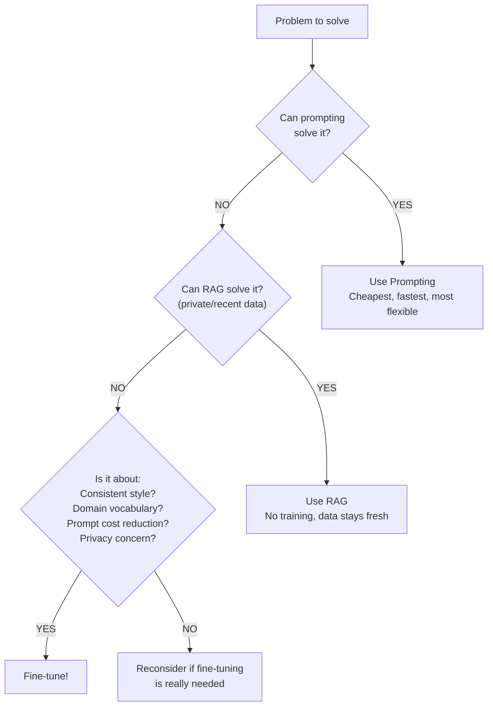
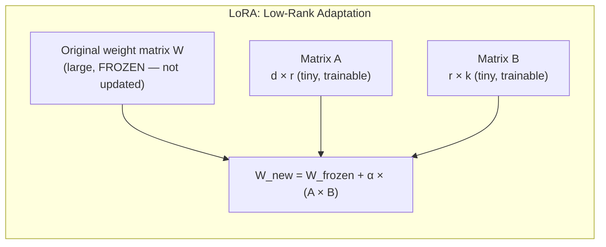
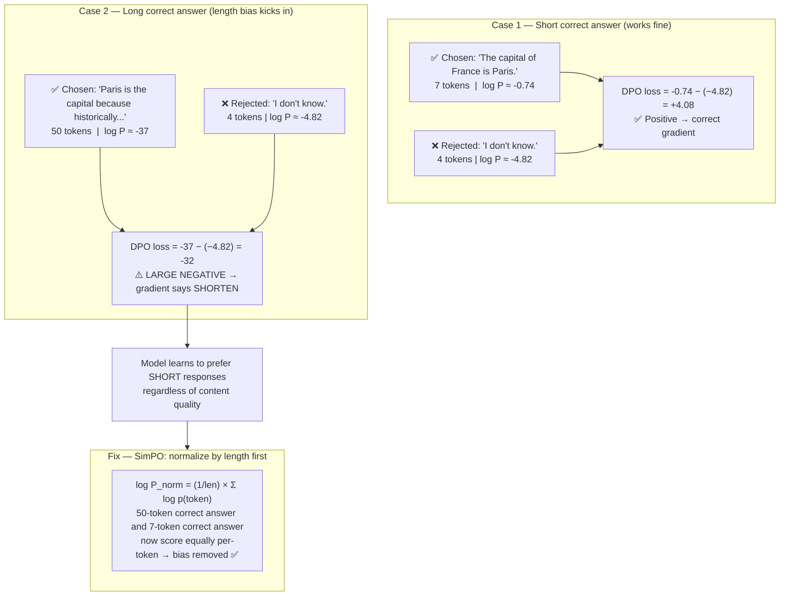

# 16 — Fine-Tuning: Teaching Models Your Specific Style and Domain

**Builds on:** Module 09 (LLM architecture + training process — fine-tuning is continuing the same pre-training gradient descent loop on new data). Module 05 (backpropagation — fine-tuning updates weights via the same mechanism). Module 12 (Model families — LLaMA, Mistral, GPT-4o-mini are the models you fine-tune here).

**Prerequisite check before reading RLHF sections:** Section 5.5 introduces RL fundamentals needed for PPO (Sections 6 and 12). Read it before jumping to those sections. Quantization basics (before QLoRA, Section 3.5) explain how INT4 works before QLoRA uses it.

---

## 1. What Is Fine-Tuning?

Fine-tuning is continuing the training of a pre-trained model on your own specific data. Think of it as the "intern to specialist" analogy:

```
PRE-TRAINED MODEL:         FINE-TUNED MODEL:
  "Brilliant generalist"     "Domain specialist"
  Knows everything           Knows YOUR domain deeply
  Generic responses          Responses in YOUR style
  Verbose explanations       Concise, formatted correctly
  May need long prompts      Works with short prompts
  Like a new hire            Like a 6-month employee
```

### What Fine-Tuning Changes

```
Model weights before fine-tuning:
  [weight_1: 0.234, weight_2: -0.891, ..., weight_N: 0.445]

Your training examples:
  {"prompt": "Summarize this...", "response": "Key points: 1. 2. 3."}
  {"prompt": "Write subject line", "response": "Subject: [Action] by [Date]"}

Model weights after fine-tuning:
  [weight_1: 0.241, weight_2: -0.887, ..., weight_N: 0.451]
  ← Slightly adjusted to better produce your expected outputs

Result: Model "knows" your preferred style without being told each time.
```

---

## 2. When to Fine-Tune



---

## 3. Types of Fine-Tuning

### Full Fine-Tuning
```
ALL model weights are updated during training.
Cost: Very high (same scale as original training)
Quality: Maximum
Risk: Catastrophic forgetting (may lose general knowledge)
Use case: Almost never for AI engineers (done by model providers)
```

### LoRA (Low-Rank Adaptation)



**Numbers (Llama 3.1 8B):**
- Full fine-tuning: 8,000,000,000 trainable params
- LoRA (rank=16): 41,943,040 trainable params — only **0.5%**
- Memory saved: ~95% less GPU RAM needed

### Quantization Basics (Required for QLoRA)

```
WHAT IS QUANTIZATION?
  Quantization = store model weights in lower numerical precision.
  LLMs store weights as floating-point numbers by default (FP32 or FP16).
  Quantization converts them to integers, which use far less memory.

PRECISION TYPES:
  FP32 (32-bit float): 4 bytes per weight — full precision
  FP16 (16-bit float): 2 bytes per weight — half precision
  INT8 (8-bit integer): 1 byte per weight — 4× smaller than FP32
  INT4 (4-bit integer): 0.5 bytes per weight — 8× smaller than FP32

HOW QUANTIZATION WORKS:
  For a weight value like 0.347:
  1. Find the range of weights in a layer: min = -2.1, max = 1.8
  2. Map this range to integer range (e.g., 0-255 for int8)
  3. Store the integer + a scaling factor to reconstruct
  4. At compute time: dequantize back to FP16, multiply, re-quantize

WHY QUALITY IS PRESERVED:
  Neural networks are surprisingly robust to precision loss.
  Most weight values are small and close to zero.
  A 4-bit representation captures the relative magnitudes well.
  Empirical result: INT4 quality loss < 1% on most benchmarks.

WHY IT MATTERS FOR TRAINING:
  Large models (70B+) don't fit in GPU memory at FP32 or even FP16.
  4-bit quantization makes them fit with 8× less memory → enables fine-tuning.
```

### QLoRA (Quantized LoRA)

```
QLoRA = Quantization + LoRA

Step 1: Load the base model in 4-bit precision (saves memory)
  FP32: Each weight = 4 bytes
  INT4: Each weight = 0.5 bytes ← 8x smaller!

Step 2: Apply LoRA adapters (in higher precision)
  The adapters themselves remain in float16/32

Result:
  7B model needs ~28GB (FP32) → ~4GB (QLoRA)
  70B model needs ~280GB      → ~35GB (fits on 1 consumer GPU!)

This makes fine-tuning frontier models accessible to everyone.
```

---

## 4. OpenAI Fine-Tuning — Complete Tutorial

```python
import os
import json
import time
from openai import OpenAI

client = OpenAI(api_key=os.environ["OPENAI_API_KEY"])

# ── Step 1: Prepare Training Data ──

training_examples = [
    {
        "messages": [
            {"role": "system", "content": "You are a customer service agent for AcmeCorp. Be concise and professional."},
            {"role": "user", "content": "What is your return policy?"},
            {"role": "assistant", "content": "Returns accepted within 30 days. Item must be unused and in original packaging. Contact returns@acmecorp.com with order number."}
        ]
    },
    {
        "messages": [
            {"role": "system", "content": "You are a customer service agent for AcmeCorp. Be concise and professional."},
            {"role": "user", "content": "My order hasn't arrived"},
            {"role": "assistant", "content": "I apologise for the delay. Please provide your order number and I'll check the status immediately. For urgent issues, call 1-800-ACME-CORP."}
        ]
    },
    # Add 50-500 more examples for best results
]

# Save as JSONL file (one JSON object per line)
with open("training_data.jsonl", "w") as f:
    for example in training_examples:
        f.write(json.dumps(example) + "\n")

print(f"Created training file with {len(training_examples)} examples")


# ── Step 2: Upload Training File ──

with open("training_data.jsonl", "rb") as f:
    upload_response = client.files.create(
        file=f,
        purpose="fine-tune"
    )

file_id = upload_response.id
print(f"Uploaded file: {file_id}")


# ── Step 3: Create Fine-Tuning Job ──

job = client.fine_tuning.jobs.create(
    training_file=file_id,
    model="gpt-4o-mini-2024-07-18",   # Model to fine-tune
    hyperparameters={
        "n_epochs": 3,                 # Number of passes through training data
        # More epochs = more specialised but risk of overfitting
        # 1-5 epochs is typical; start with 3
    },
    suffix="customer-service"          # Custom suffix for model name
    # Your model will be named: ft:gpt-4o-mini-...:customer-service
)

job_id = job.id
print(f"Fine-tuning job created: {job_id}")


# ── Step 4: Monitor Training Progress ──

print("Monitoring training...")
while True:
    status = client.fine_tuning.jobs.retrieve(job_id)
    print(f"Status: {status.status}")

    if status.status == "succeeded":
        fine_tuned_model = status.fine_tuned_model
        print(f"\n✓ Training complete! Model: {fine_tuned_model}")
        break

    if status.status in ["failed", "cancelled"]:
        print(f"✗ Training failed: {status.error}")
        break

    # Show training events (loss at each step)
    events = client.fine_tuning.jobs.list_events(job_id, limit=5)
    for event in events.data:
        print(f"  Event: {event.message}")

    time.sleep(60)  # Check every minute


# ── Step 5: Use the Fine-Tuned Model ──

response = client.chat.completions.create(
    model=fine_tuned_model,   # Your custom model!
    messages=[
        {"role": "system", "content": "You are a customer service agent for AcmeCorp."},
        {"role": "user", "content": "How do I track my order?"}
    ]
)
print(f"\nFine-tuned response: {response.choices[0].message.content}")


# ── Cost Calculation ──
# OpenAI charges per token for fine-tuning
# Pricing (approximate): $8 per million training tokens for gpt-4o-mini

def estimate_fine_tuning_cost(
    num_examples: int,
    avg_tokens_per_example: int,
    n_epochs: int
) -> dict:
    total_tokens = num_examples * avg_tokens_per_example * n_epochs
    cost_per_million = 8.00   # $/1M tokens for gpt-4o-mini
    total_cost = (total_tokens / 1_000_000) * cost_per_million

    return {
        "total_training_tokens": total_tokens,
        "estimated_cost": f"${total_cost:.2f}",
        "model": "gpt-4o-mini"
    }

cost = estimate_fine_tuning_cost(
    num_examples=500,
    avg_tokens_per_example=200,
    n_epochs=3
)
print(f"\nEstimated cost: {cost}")
```

---

## 5. HuggingFace + PEFT — LoRA Tutorial

```python
# pip install transformers peft trl bitsandbytes accelerate datasets

from transformers import (
    AutoModelForCausalLM,
    AutoTokenizer,
    TrainingArguments,
    BitsAndBytesConfig
)
from peft import LoraConfig, get_peft_model, TaskType, AutoPeftModelForCausalLM
from trl import SFTTrainer
from datasets import Dataset
import torch


# ── Step 1: Load base model with 4-bit quantization ──

model_name = "meta-llama/Meta-Llama-3.1-8B-Instruct"

# Configure 4-bit quantization (QLoRA)
bnb_config = BitsAndBytesConfig(
    load_in_4bit=True,                     # Load model in 4-bit precision
    bnb_4bit_quant_type="nf4",             # NF4 quantization (best quality)
    bnb_4bit_compute_dtype=torch.float16,  # Compute in float16
    bnb_4bit_use_double_quant=True,        # Double quantize to save more memory
)

tokenizer = AutoTokenizer.from_pretrained(model_name)
tokenizer.pad_token = tokenizer.eos_token  # Needed for batch training

model = AutoModelForCausalLM.from_pretrained(
    model_name,
    quantization_config=bnb_config,   # Apply 4-bit loading
    device_map="auto",                 # Automatically place on GPU(s)
)

# ── Step 2: Configure LoRA ──

lora_config = LoraConfig(
    task_type=TaskType.CAUSAL_LM,    # We're fine-tuning a language model
    r=16,                             # LoRA rank: 4-64. Higher = more capacity but more memory
                                      # Start with 16; increase if performance is poor
    lora_alpha=32,                    # Scaling factor. Usually set to 2× rank
    lora_dropout=0.05,               # Dropout regularization (prevents overfitting)
    bias="none",                      # Don't fine-tune bias parameters
    target_modules=[                  # Which layers to add LoRA adapters to
        "q_proj", "v_proj",           # Query and value projections in attention
        "k_proj", "o_proj",           # Key and output projections
        "gate_proj", "up_proj", "down_proj"  # Feed-forward network layers
    ],
)

# Apply LoRA adapters to the model
model = get_peft_model(model, lora_config)

# Show how many parameters we're actually training (should be <1%)
model.print_trainable_parameters()
# Output: trainable params: 41,943,040 || all params: 8,072,667,136 || trainable%: 0.5195

# ── Step 3: Prepare Dataset ──

# For Llama 3.1, format with special tokens
def format_instruction(example):
    return (
        f"<|begin_of_text|>"
        f"<|start_header_id|>system<|end_header_id|>\n\n"
        f"You are a helpful assistant.<|eot_id|>"
        f"<|start_header_id|>user<|end_header_id|>\n\n"
        f"{example['instruction']}<|eot_id|>"
        f"<|start_header_id|>assistant<|end_header_id|>\n\n"
        f"{example['output']}<|eot_id|>"
    )

# Example dataset (replace with your data)
raw_data = [
    {"instruction": "Explain Python decorators", "output": "Decorators are functions that wrap other functions..."},
    {"instruction": "What is a neural network?", "output": "A neural network is a computational model..."},
    # Add more examples...
]

dataset = Dataset.from_list(raw_data)

# ── Step 4: Configure Training ──

training_args = TrainingArguments(
    output_dir="./llama_lora_output",     # Where to save checkpoints
    num_train_epochs=3,                   # Training passes through data
    per_device_train_batch_size=4,        # Examples per GPU per step
    gradient_accumulation_steps=4,        # Accumulate 4 steps before update
                                          # Effective batch size = 4 × 4 = 16
    warmup_steps=100,                     # Gradually increase LR at start
    learning_rate=2e-4,                   # Learning rate (2e-4 good for LoRA)
    fp16=True,                            # Mixed precision training
    logging_steps=50,                     # Log metrics every 50 steps
    save_strategy="epoch",                # Save checkpoint at each epoch
    report_to="none",                     # "wandb" to use Weights & Biases
    optim="paged_adamw_32bit",            # Memory-efficient optimizer for QLoRA
)

# ── Step 5: Train ──

trainer = SFTTrainer(
    model=model,
    args=training_args,
    train_dataset=dataset,
    formatting_func=format_instruction,   # Format examples for the model
    max_seq_length=2048,                   # Max token length per example
)

print("Starting training...")
trainer.train()
print("Training complete!")

# ── Step 6: Save ──

trainer.save_model("./my_finetuned_model")
tokenizer.save_pretrained("./my_finetuned_model")

# ── Optional: Merge LoRA weights into base model ──
# This creates a standalone model that doesn't need PEFT library to load

merged_model = AutoPeftModelForCausalLM.from_pretrained(
    "./my_finetuned_model",
    torch_dtype=torch.float16,
)
merged_model = merged_model.merge_and_unload()  # Merge LoRA into base weights
merged_model.save_pretrained("./merged_model")
tokenizer.save_pretrained("./merged_model")
print("Model merged and saved!")
```

---

## 5.5 RL Primer for RLHF (Read Before Section 6)

RLHF uses Reinforcement Learning concepts. Here's the minimal foundation needed.

```
REINFORCEMENT LEARNING — CORE VOCABULARY:

  Agent: the entity that takes actions (here: the LLM generating text)
  Environment: what the agent interacts with (here: the human evaluating text)
  State (s): what the agent observes (here: the conversation so far)
  Action (a): what the agent does (here: generate the next token)
  Reward (R): scalar signal after an action (here: human preference score)
  Policy (π): the agent's strategy: given state s, which action a to take?
    In RLHF: policy = the LLM itself; π_θ(a|s) = P(next token | context)

  The RL goal: find policy π that MAXIMIZES expected cumulative reward.

POLICY GRADIENT — HOW RL TRAINS A POLICY:
  Unlike supervised learning (minimize loss on labeled data),
  RL optimizes the policy by directly maximizing expected reward.

  Intuition: if action a in state s led to high reward R,
  increase P(a|s). If low reward, decrease P(a|s).

  REINFORCE gradient (simplest policy gradient):
    ∇_θ J = E[R × ∇_θ log π_θ(a|s)]
    "Reinforce actions that got high reward; suppress those that got low reward"

ADVANTAGE FUNCTION:
  Raw reward R is noisy (some tasks are inherently hard).
  Advantage A(s,a) = R(s,a) − baseline
  Baseline = average reward in state s (what would happen with a typical action)
  Advantage > 0: this action was better than average → reinforce it
  Advantage < 0: this action was worse than average → suppress it

WHY THIS MATTERS FOR RLHF:
  PPO (Proximal Policy Optimization) is a specific policy gradient algorithm
  that prevents the policy from changing TOO MUCH in one step.
  It optimizes the policy while keeping it close to the reference (SFT) model.
  → More stable than raw REINFORCE; preferred for RLHF training.
```

---

## 6. RLHF Overview

```
RLHF = Reinforcement Learning from Human Feedback

WHY IT'S NEEDED:
  After SFT, the model follows instructions but may be:
  - Sycophantic (tells users what they want to hear)
  - Unhelpful (technically correct but misses the point)
  - Harmful (provides dangerous information)

THREE PHASES:

Phase 1: SFT (Supervised Fine-Tuning)
  Train on expert demonstrations: instruction → ideal response
  Result: Model that can follow instructions

Phase 2: Reward Model Training
  Show humans pairs of responses to same prompt
  Humans rank which is better
  Train a separate "reward model" to predict human preferences

Phase 3: PPO (Proximal Policy Optimisation)
  Use reward model to score LLM outputs
  Update LLM to maximise reward (while not drifting too far from SFT)
  Result: Model aligned with human preferences

Used by: GPT-4, Claude 3, Gemini — all production LLMs use RLHF or similar
```

---

## 7. DPO (Direct Preference Optimisation)

```python
# DPO is a simpler alternative to RLHF
# Instead of training a separate reward model, train directly on preference pairs

from trl import DPOTrainer, DPOConfig
from datasets import Dataset

# Preference data format: prompt + chosen (better) + rejected (worse) response
preference_data = [
    {
        "prompt": "Explain quantum physics",
        "chosen": "Quantum physics describes the behavior of matter at atomic scales...",
        "rejected": "Quantum physics is really hard and complicated, trust me..."
    },
    {
        "prompt": "Write a poem about rain",
        "chosen": "Silver drops on dusty leaves, the earth drinks deep...",
        "rejected": "Rain falls down from the sky. It is wet. I like rain."
    },
]

dataset = Dataset.from_list(preference_data)

dpo_config = DPOConfig(
    beta=0.1,           # How strongly to deviate from base model
                        # Lower = stay close to base model behavior
                        # Higher = more willing to change
    learning_rate=1e-5,
    num_train_epochs=1,
)

# trainer = DPOTrainer(
#     model=model,
#     ref_model=ref_model,   # Frozen reference model (the base)
#     args=dpo_config,
#     train_dataset=dataset,
# )
# trainer.train()
```

---

## 8. LoRA Hyperparameter Guide

```
RANK (r): Controls capacity of LoRA adapters
──────────────────────────────────────────────
  r=4:   Very lightweight, simple style changes
  r=8:   Light, good for tone/format changes
  r=16:  Standard, good for most tasks (START HERE)
  r=32:  More capacity, complex domain adaptation
  r=64+: High capacity, large training datasets

ALPHA: Scaling factor for LoRA updates
──────────────────────────────────────
  Rule: alpha = 2 × rank (e.g., r=16, alpha=32)
  Higher alpha = larger updates to base model
  If outputs are too generic: try higher alpha
  If outputs are too strange: try lower alpha

LEARNING RATE:
────────────────────────────────────────────────
  For LoRA: 1e-4 to 5e-4 (higher than full fine-tuning)
  Start: 2e-4
  Adjust: if loss doesn't decrease, try higher
           if loss oscillates, try lower

EPOCHS:
───────────────────────────────────────────────
  1 epoch:  If you have 1000+ examples
  3 epochs: Standard starting point
  5 epochs: If you have <100 examples
  Watch validation loss: stop if it increases (overfitting)
```

---

## Key Points for Exam Prep

```
FINE-TUNING CHEAT SHEET:
  - Fine-tune for: style, format, domain vocab, reduced prompts
  - DON'T fine-tune for: knowledge (use RAG), one-time tasks
  - LoRA: freeze base, add tiny A×B matrices, only train those
  - QLoRA: 4-bit quantization + LoRA = runs on consumer GPU
  - OpenAI format: JSONL with {"messages": [...]} per line
  - Minimum: 50 examples; ideal: 200-500 quality examples
  - n_epochs: 3 is a good starting point
  - RLHF: SFT → Reward Model → PPO → aligned model
  - DPO: simpler alternative to RLHF using preference pairs
  - Always evaluate before/after: compare on held-out test set
```

## Practice Questions

1. What is the difference between fine-tuning and RAG?
2. What does LoRA do and why is it more efficient than full fine-tuning?
3. What is QLoRA and why does it make 70B model fine-tuning accessible?
4. What format does OpenAI require for fine-tuning data?
5. What are the three phases of RLHF?
6. What is DPO and how does it differ from RLHF?
7. What minimum number of examples do you need for OpenAI fine-tuning?
8. What is catastrophic forgetting and how does LoRA help avoid it?
9. What does the rank (r) parameter in LoRA control?
10. How many trainable parameters does a rank-16 LoRA have vs full fine-tuning?
11. When would you increase the number of training epochs?
12. What is the difference between SFT and RLHF in training?
13. How do you evaluate if fine-tuning improved your model?
14. What is the OpenAI fine-tuning file_id used for?
15. What is the `merge_and_unload()` step and why would you use it?

---

## 9. RLAIF — Reinforcement Learning from AI Feedback

RLAIF replaces human preference annotators with a large language model (the "AI judge"), enabling preference data at scale.

```
MOTIVATION:
  RLHF bottleneck: human annotation is slow (~$1/comparison), limited
  to 100K-1M examples before costs become prohibitive.
  RLAIF: generate 10M+ preference pairs using GPT-4 / Claude as judge.
  Cost: ~100x cheaper than human annotation.

RLAIF PIPELINE:
  1. Generate response pairs for sampled prompts using the base model
  2. LLM judge evaluates: "Which response is better? A or B?"
  3. Collect (prompt, chosen, rejected) pairs
  4. Train reward model on AI-labeled preferences
  5. Run PPO or use DPO directly on preference pairs

CONSTITUTIONAL AI (Anthropic, 2022):
  A specific RLAIF method where the "judge" uses a written constitution
  (a set of principles) to evaluate responses.

  Phase 1 — Supervised Learning from AI Feedback (SLAIC):
    - Generate potentially harmful responses with red-team prompts
    - Ask Claude to critique responses against the constitution
      ("The response violates principle 2: it provides instructions
       that could harm a third party...")
    - Ask Claude to revise the response to comply
    - Fine-tune on the revised (better) responses

  Phase 2 — RL from AI Feedback (RLAIF):
    - Generate A/B response pairs
    - Claude scores each pair against the constitution
    - Train reward model on AI preference labels
    - PPO with this reward model

  Constitutional principles example (abbreviated):
    "Choose the response that is least likely to be used
     by a malicious actor."
    "Choose the response that is least harmful and most helpful."
    "Choose the response that is most consistent with a
     helpful, harmless, and honest AI assistant."

RLAIF RISKS vs HUMAN RLHF:
  ✗ Verbosity bias: AI judges tend to prefer longer responses
    even when shorter responses are more accurate
  ✗ Self-preference: a model judges its own outputs more favorably
    (use a different model as the judge where possible)
  ✗ Sycophancy amplification: if the judge is sycophantic,
    it rewards sycophantic responses → positive feedback loop
  ✗ Style over substance: AI judges reward confident-sounding
    responses even when factually incorrect

MITIGATION:
  Use a diverse ensemble of judge models (not just one)
  Include humans in quality control for high-stakes domains
  Evaluate judge outputs with blind human review samples
```

---

## 10. IPO (Identity Preference Optimization)

DPO can suffer from overfitting to the preference dataset. IPO is a regularized alternative.

```
DPO FAILURE MODES — three distinct problems:

1. PROBABILITY COLLAPSE (distributional shift):
  DPO objective: maximize log P(chosen) - log P(rejected)
  If the chosen/rejected margin in the data is too large,
  DPO can drive the probability of the rejected response to
  near-zero, causing overly deterministic outputs.
  This degrades diversity and off-distribution generalization.

2. LENGTH BIAS:



  DPO uses log-likelihood SUM over tokens: log P(response) = Σ_t log p(t_i)
  Longer responses have more terms in the sum → naturally lower log-likelihood.
  Result: DPO implicitly penalizes longer responses MORE than shorter ones,
  causing the model to prefer shorter responses even when they are less correct.

  Mechanistically:
    log P(short rejected, 20 tokens)  ≈  -30   (small penalty)
    log P(long chosen,   100 tokens)  ≈  -150  (large penalty due to length)
    DPO loss = log P(chosen) - log P(rejected) = -150 - (-30) = -120
    → Huge negative gap → gradient pushes to shorten responses

  Fix — length-normalize the log-likelihood:
    Use log P(response) / len(response) instead of the raw sum.
    SimPO (Simple Preference Optimization, 2024) makes this the default.

3. LABEL NOISE SENSITIVITY:
  Without a reward model providing averaging, noisy annotation directly
  corrupts training signal. IPO's soft target regularization mitigates this.

IPO SOLUTION:
  Adds a regularization term that penalizes being too confident:
    IPO loss = (log P(chosen)/P(rejected) - 1/(2β))²
  The squared term creates a soft target — the model learns to
  prefer chosen responses by exactly 1/(2β) in log-space,
  not by "as much as possible."

  Result:
    - More stable training than DPO (no probability collapse)
    - Better off-distribution generalization
    - Preferred when training data has noisy preference labels

```

DPO vs IPO vs RLHF comparison:

| Method | Reward model | Stability | Best for |
|--------|-------------|-----------|----------|
| RLHF (PPO) | Required | Low (PPO tuning) | Large teams, high-quality RM |
| DPO | Not required | Medium | Most use cases, 10K-100K pairs |
| IPO | Not required | High | Noisy data, diversity matters |
| SimPO | Not required | High | Length-sensitive tasks; avoids DPO length bias |
| RLAIF | AI-generated | Medium | Large scale, low annotation cost |

---

## 11. Code Execution as a Grounding Signal

For code-related tasks, you can verify model outputs objectively — by running them.

```
THE KEY INSIGHT:
  For code review, code generation, and debugging assistants,
  the ground truth is executable: does the suggested fix
  pass the test suite? This bypasses reward model noise entirely.

GROUNDING SIGNAL PIPELINE:

  Step 1: Generate candidate responses
    prompt = "Here is a failing test: {test_code}\nHere is the function: {function}\nFix the function."
    candidates = [model.generate(prompt) for _ in range(N)]  # N samples

  Step 2: Execute each candidate
    for candidate in candidates:
        patched_code = apply_patch(original_code, candidate)
        result = run_tests(patched_code, test_suite)
        score = 1 if result.passed else 0
        # Optional: partial credit = fraction of tests passed

  Step 3: Build preference pairs from execution results
    pairs = []
    for i, ci in enumerate(candidates):
        for j, cj in enumerate(candidates):
            if scores[i] > scores[j]:
                pairs.append({
                    "prompt": prompt,
                    "chosen": ci,  # passed more tests
                    "rejected": cj # passed fewer tests
                })

  Step 4: Train with DPO on execution-grounded pairs
    This produces an alignment signal with near-zero label noise —
    test execution is deterministic and objective.

APPLICATIONS:
  - AlphaCode: generates N candidate programs, filters by execution
  - SWE-bench style evaluations: patches graded by test suite pass rate
  - Code review assistant: reward = does the review catch the real bug?

CODE EXECUTION REWARD HIERARCHY (from weakest to strongest):
  1. LLM-as-judge (most noise — style and confidence bias)
  2. Human preference annotation (slow, expensive)
  3. Test execution: pass/fail (objective, but limited to tested cases)
  4. Formal verification (strongest, but rarely applicable)

PRACTICAL IMPLEMENTATION NOTES:
  - Sandbox code execution (Docker container, gVisor) — never run
    LLM-generated code in your host environment
  - Timeout per execution (5-30 seconds)
  - Capture stdout, stderr, return code and exit status
  - Test suite must cover edge cases to avoid reward hacking
    (model finds edge cases not covered by tests and exploits them)

REWARD HACKING IN CODE DOMAIN:
  Model may learn to write code that passes the specific tests
  without solving the general problem:
    - Hardcode expected outputs for test inputs
    - Special-case the test inputs with if statements
  Mitigation: use diverse test sets, include property-based tests,
  periodically add new tests from failed edge cases in production.
```

---

## 12. RLHF — PPO Mechanics in Depth

```
RLHF FULL PIPELINE (three models in play simultaneously):

  Models involved:
    π_ref   = reference model (frozen SFT model; provides KL baseline)
    π_θ     = policy model (the LLM being trained; updated by PPO)
    r_φ     = reward model (trained on human preference data)

PHASE 1 — REWARD MODEL TRAINING:
  Data format: (prompt, response_A, response_B, human_preference: A > B)
  Training: reward_model learns to predict the preferred response.
    r_φ(prompt, response) → scalar reward score
  Architecture: same as SFT model but last layer replaced with linear → scalar
  Loss: Bradley-Terry preference model:
    L_RM = -log σ(r_φ(chosen) − r_φ(rejected))
  Scale of data needed: 10K-100K preference comparisons (much less than SFT)

PHASE 2 — PPO (Proximal Policy Optimization) TRAINING:
  For each training step:
  1. Sample prompt p from dataset
  2. Policy generates response y: y ~ π_θ(·|p)
  3. Reward model scores: R = r_φ(p, y)
  4. KL divergence penalty:
     R_adjusted = R − β × KL(π_θ(y|p) || π_ref(y|p))
     where β ≈ 0.1-0.5 (KL coefficient)
  5. PPO loss update on π_θ to maximize R_adjusted

  The KL PENALTY is critical:
    Without KL: policy learns to "game" the reward model
    (produce responses that score high but aren't actually good)
    With KL: policy stays close to the SFT baseline → prevents reward hacking
    β is a hyperparameter: too high → won't learn, too low → reward hacking

PPO CLIPPING (the "P" in PPO):
  PPO adds a clipping mechanism to stabilize policy gradient updates:
    L_PPO = min( r_t × A_t, clip(r_t, 1−ε, 1+ε) × A_t )
  where:
    r_t = π_θ(a_t|s_t) / π_old(a_t|s_t)  (probability ratio)
    A_t = advantage estimate (how much better/worse than baseline)
    ε = 0.2 (typical clipping range)
  This prevents excessively large policy updates that destabilize training.

REWARD MODEL SCALING:
  More preference data → better reward model → better RLHF alignment
  Critical failure mode: reward overoptimization
    As KL divergence grows, reward model score keeps increasing...
    but actual quality peaks and then DECREASES.
    (Gao et al. 2022: "Scaling Laws for Reward Model Overoptimization")
  → RLHF training must be stopped early before reward model is "cheated"
  → Monitor with held-out human eval, not just reward model score

WHY RLHF BEATS SFT FOR ALIGNMENT:
  SFT: maximizes P(expert_response | prompt) — imitates, doesn't optimize
  RLHF: directly optimizes for human-judged quality
  Example: SFT on "how are you?" → copies expert's "I'm fine" verbatim
           RLHF → learns to produce responses humans prefer, even novel ones
```

---

## 13. PEFT Methods Beyond LoRA

```
PEFT FAMILY COMPARISON:

METHOD 1: LoRA (Low-Rank Adaptation) — already covered
  Trainable: weight delta matrices (A × B) per target layer
  Parameters: ~0.1-1% of model
  Memory: moderate (adapters + frozen base in FP16)
  Best for: most fine-tuning tasks; instruction following; domain adaptation

METHOD 2: Prefix Tuning (Li & Liang 2021)
  Idea: prepend learned "virtual tokens" to the key and value sequences
  of every attention layer. The frozen model attends to these tokens.

  Architecture:
    Normal attention: Attend over [prompt tokens]
    Prefix tuning: Attend over [prefix tokens; prompt tokens]
    prefix tokens are learned embeddings, NOT real text tokens

  Parameters: prefix_length × num_layers × 2 (K, V) × d_model
    e.g., prefix_length=20: 20 × 32 × 2 × 4096 = 5.2M params for 7B model

  Advantages:
    ✓ Frozen base model (safe for multi-tenant serving — one base, many tasks)
    ✓ Easy task switching (swap prefix vectors)
    ✓ Good for conditional generation tasks
  Disadvantages:
    ✗ Harder to optimize than LoRA (gradient flows through frozen attention)
    ✗ Limited capacity (only prefix tokens)
    ✗ Performance lags LoRA on most benchmarks

METHOD 3: Prompt Tuning (Lester et al. 2021)
  Simplified version of prefix tuning: only prepend soft tokens to the INPUT
  layer (not every layer).

  Parameters: prefix_length × d_model (much fewer than prefix tuning)
  Best for: classification, short-form tasks
  Limitation: insufficient capacity for complex generation tasks

METHOD 4: IA3 (Infused Adapter by Inhibiting and Amplifying Inner Activations)
  Liu et al. 2022.
  Adds learned vectors that SCALE (not add) intermediate activations:
    h' = l × h   (element-wise multiply by learned scale vector l)
  Applied to: key, value, and FFN intermediate activations

  Parameters: very few (~0.01% of model, vs LoRA's ~0.5%)
  Advantages:
    ✓ Even more parameter-efficient than LoRA
    ✓ Multiple IA3 adapters can be added without significant overhead
    ✓ Works well on few-shot fine-tuning
  Disadvantages:
    ✗ Lower capacity than LoRA — may not capture complex task shifts

```

**Choosing a PEFT method:**

| Method | Params (7B base) | Quality | Best for |
|--------|-----------------|---------|----------|
| LoRA (r=16) | ~42M (0.5%) | High | General fine-tuning |
| Prefix Tuning | ~5M (0.07%) | Medium | Multi-task serving |
| Prompt Tuning | ~0.1M (0.001%) | Low-Medium | Classification |
| IA3 | ~0.7M (0.01%) | Medium | Few-shot adaptation |
| Full fine-tune | 7000M (100%) | Highest | Rarely (requires huge GPU) |

---
*Next: [24 — LLMOps](../24-llmops/README.md)*
