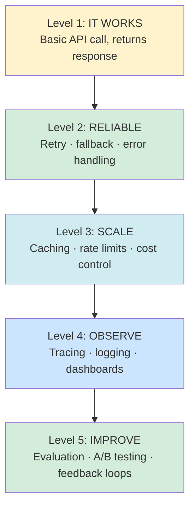

# 17 — LLMOps: Running AI in Production

---

## 1. What Is LLMOps?

**LLMOps** = the practices and tools for deploying, monitoring, and improving LLM-powered applications in production.

```
LLMOps vs MLOps:
───────────────────────────────────────────────────────────────────────
Traditional MLOps               LLMOps (NEW challenges)
─────────────────────           ─────────────────────────────────────
Model accuracy metrics          Output QUALITY metrics (harder to measure)
Feature drift detection         Prompt drift and hallucination monitoring
Retrain on new data             Update prompts + RAG knowledge base
Batch prediction                Real-time streaming generation
Data labelling pipelines        LLM-as-judge evaluation
A/B test model versions         A/B test PROMPT versions
```

### The Production Readiness Pyramid



Most apps stop at Level 2. Production-ready means Level 4–5.

---

## 2. Evaluation

### LLM-as-Judge

```python
from openai import OpenAI
import json

client = OpenAI()

def llm_judge(
    question: str,
    answer: str,
    context: str = None,
    rubric: list[str] = None
) -> dict:
    """
    Use a powerful LLM to evaluate the quality of another LLM's output.

    LLM-as-judge scales better than human evaluation.
    Use GPT-4o as judge even if your app uses a cheaper model.

    Args:
        question: The question that was asked
        answer: The answer to evaluate
        context: Optional: reference information the answer should use
        rubric: Optional criteria to evaluate

    Returns:
        Scores and reasoning for each criterion
    """
    criteria = rubric or [
        "Accuracy: Is the information correct?",
        "Completeness: Does it fully address the question?",
        "Clarity: Is it clear and well-written?",
        "Appropriateness: Is the tone suitable?"
    ]

    criteria_text = "\n".join(f"{i+1}. {c}" for i, c in enumerate(criteria))

    context_section = ""
    if context:
        context_section = f"\nReference context:\n{context}\n"

    prompt = f"""You are an impartial evaluator assessing AI assistant responses.

Question: {question}
{context_section}
Answer to evaluate:
{answer}

Rate the answer on these criteria (1-10 each):
{criteria_text}

Return ONLY valid JSON:
{{
  "scores": {{"accuracy": N, "completeness": N, "clarity": N, "appropriateness": N}},
  "overall": N,
  "reasoning": "Brief explanation",
  "pass": true/false  (pass = overall >= 7)
}}"""

    response = client.chat.completions.create(
        model="gpt-4o",    # Use best model for judging
        messages=[{"role": "user", "content": prompt}],
        temperature=0,
        response_format={"type": "json_object"}
    )

    return json.loads(response.choices[0].message.content)


# Example
result = llm_judge(
    question="What is the return policy?",
    answer="You can return items within 30 days.",
    context="Our return policy allows returns within 30 days of purchase date.",
)
print(f"Overall: {result['overall']}/10 | Pass: {result['pass']}")
print(f"Reasoning: {result['reasoning']}")
```

### Building an Eval Dataset

```python
def create_eval_dataset(
    rag_system_fn,    # Your RAG function
    golden_qas: list[dict]
) -> dict:
    """
    Evaluate a RAG system against a set of golden Q&A pairs.

    golden_qas format: [{"question": "...", "expected_answer": "..."}]
    """
    results = []
    scores = []

    for qa in golden_qas:
        # Run your system
        actual_answer = rag_system_fn(qa["question"])

        # Judge the output
        judgment = llm_judge(
            question=qa["question"],
            answer=actual_answer
        )

        # Simple string match as backup
        keyword_match = any(
            kw.lower() in actual_answer.lower()
            for kw in qa["expected_answer"].split()[:3]  # Check first 3 words
        )

        scores.append(judgment["overall"])
        results.append({
            "question": qa["question"],
            "expected": qa["expected_answer"],
            "actual": actual_answer,
            "score": judgment["overall"],
            "pass": judgment["pass"],
            "keyword_match": keyword_match
        })

    return {
        "avg_score": sum(scores) / len(scores),
        "pass_rate": sum(1 for r in results if r["pass"]) / len(results),
        "results": results
    }
```

---

## 3. Observability with LangSmith

```python
# pip install langsmith langchain-openai

import os
from langsmith import traceable
from langchain_openai import ChatOpenAI
from langchain_community.vectorstores import Chroma
from langchain_openai import OpenAIEmbeddings

# Enable LangSmith tracing with env vars
os.environ["LANGCHAIN_TRACING_V2"] = "true"
os.environ["LANGCHAIN_API_KEY"] = os.environ.get("LANGSMITH_API_KEY", "")
os.environ["LANGCHAIN_PROJECT"] = "my-ai-application"


# All LangChain calls are automatically traced!
llm = ChatOpenAI(model="gpt-4o")
response = llm.invoke("Explain transformers")
# → Automatically logged in LangSmith: input, output, latency, cost


# Use @traceable to trace custom functions
@traceable(name="rag-pipeline")
def rag_pipeline(question: str) -> str:
    """This entire function + its sub-steps are traced."""
    context = retrieve_context(question)   # Each sub-call also traced
    answer = generate_answer(question, context)
    return answer


@traceable(name="retrieve-context")
def retrieve_context(question: str) -> list:
    # Vector DB retrieval — traced automatically
    vectorstore = Chroma(embedding_function=OpenAIEmbeddings())
    docs = vectorstore.similarity_search(question, k=3)
    return [d.page_content for d in docs]


@traceable(name="generate-answer")
def generate_answer(question: str, context: list) -> str:
    context_text = "\n".join(context)
    response = llm.invoke(f"Context: {context_text}\nQuestion: {question}")
    return response.content


# Add user feedback after getting response
from langsmith import Client

langsmith_client = Client()

def add_user_feedback(run_id: str, is_helpful: bool, comment: str = ""):
    """Record user feedback in LangSmith for analysis."""
    langsmith_client.create_feedback(
        run_id=run_id,
        key="user_feedback",
        score=1 if is_helpful else 0,
        comment=comment
    )
```

---

## 4. Observability with Langfuse (Open Source)

```python
# pip install langfuse

from langfuse import Langfuse
from langfuse.decorators import observe, langfuse_context
import os

langfuse = Langfuse(
    public_key=os.environ["LANGFUSE_PUBLIC_KEY"],
    secret_key=os.environ["LANGFUSE_SECRET_KEY"],
    host="https://cloud.langfuse.com"  # or your self-hosted URL
)


@observe()   # Automatically traces this function
def my_llm_call(user_message: str, user_id: str) -> str:
    """
    The @observe decorator automatically records:
    - Input and output
    - Latency
    - Model used
    - Token counts
    - Error if any
    """
    from openai import OpenAI
    client = OpenAI()

    # Add metadata for filtering in dashboard
    langfuse_context.update_current_observation(
        metadata={
            "user_id": user_id,
            "feature": "customer_chat"
        }
    )

    response = client.chat.completions.create(
        model="gpt-4o",
        messages=[{"role": "user", "content": user_message}]
    )

    answer = response.choices[0].message.content

    # Record output score (e.g., from content moderation)
    langfuse_context.score_current_observation(
        name="moderation_passed",
        value=1   # 1 = passed, 0 = failed
    )

    return answer


# Record user feedback
def record_feedback(trace_id: str, thumbs_up: bool):
    """Record that the user liked or disliked the response."""
    langfuse.score(
        trace_id=trace_id,
        name="user_rating",
        value=1 if thumbs_up else 0
    )
```

---

## 5. Caching

```python
import redis
import hashlib
import json
from openai import OpenAI

client = OpenAI()
redis_client = redis.Redis(host='localhost', port=6379, db=0, decode_responses=True)

# ── Exact-match cache ──

def cached_llm_call(
    messages: list,
    model: str = "gpt-4o",
    temperature: float = 0,
    ttl_seconds: int = 3600
) -> str:
    """
    Cache LLM responses for identical requests.
    Only use for deterministic calls (temperature=0).

    Save up to 80% of costs on repeated/similar queries.
    """
    if temperature != 0:
        # Don't cache non-deterministic calls
        return direct_call(messages, model, temperature)

    # Create cache key from inputs
    cache_key = hashlib.md5(
        json.dumps({"messages": messages, "model": model}, sort_keys=True).encode()
    ).hexdigest()

    # Check cache
    cached = redis_client.get(f"llm:{cache_key}")
    if cached:
        return json.loads(cached)

    # Call API
    response = client.chat.completions.create(
        model=model, messages=messages, temperature=temperature
    )
    result = response.choices[0].message.content

    # Store in cache with expiry
    redis_client.setex(f"llm:{cache_key}", ttl_seconds, json.dumps(result))

    return result


def direct_call(messages, model, temperature) -> str:
    response = client.chat.completions.create(
        model=model, messages=messages, temperature=temperature
    )
    return response.choices[0].message.content
```

---

## 6. Rate Limiting and Retry

```python
# pip install tenacity

from tenacity import (
    retry,
    stop_after_attempt,
    wait_exponential,
    retry_if_exception_type,
    before_sleep_log
)
from openai import RateLimitError, APIConnectionError, APITimeoutError
import logging

logger = logging.getLogger(__name__)


@retry(
    retry=retry_if_exception_type((RateLimitError, APIConnectionError, APITimeoutError)),
    stop=stop_after_attempt(4),           # Max 4 total attempts
    wait=wait_exponential(
        multiplier=1, min=4, max=60       # 4s, 8s, 16s, 32s...
    ),
    before_sleep=lambda state: logger.warning(
        f"Retrying after {type(state.outcome.exception()).__name__}. "
        f"Attempt {state.attempt_number}/4"
    )
)
def resilient_llm_call(messages: list, model: str = "gpt-4o") -> str:
    """LLM call with automatic retry on transient failures."""
    response = client.chat.completions.create(
        model=model,
        messages=messages,
        timeout=30   # Don't wait more than 30 seconds
    )
    return response.choices[0].message.content


# ── Model fallback chain ──

def call_with_fallback(messages: list) -> str:
    """
    Try primary model → fallback if it fails.
    Ensures availability even when a specific provider has issues.
    """
    from anthropic import Anthropic
    import openai

    providers = [
        ("gpt-4o", lambda: client.chat.completions.create(
            model="gpt-4o", messages=messages
        ).choices[0].message.content),

        ("claude-3-5-sonnet", lambda: Anthropic().messages.create(
            model="claude-3-5-sonnet-20241022",
            max_tokens=1024,
            messages=messages
        ).content[0].text),
    ]

    for name, call_fn in providers:
        try:
            result = call_fn()
            logger.info(f"Used provider: {name}")
            return result
        except Exception as e:
            logger.warning(f"Provider {name} failed: {e}. Trying next...")

    raise Exception("All providers failed")
```

---

## 7. Cost Optimization

```python
import time
from openai import OpenAI

client = OpenAI()


def track_cost(response, model: str) -> dict:
    """Calculate cost for an OpenAI API call."""
    # Pricing per 1K tokens (approximate 2025 prices)
    pricing = {
        "gpt-4o":       {"input": 0.0025, "output": 0.01},
        "gpt-4o-mini":  {"input": 0.00015, "output": 0.0006},
        "gpt-3.5-turbo": {"input": 0.0005, "output": 0.0015}
    }

    prices = pricing.get(model, {"input": 0.001, "output": 0.002})
    input_cost  = (response.usage.prompt_tokens / 1000) * prices["input"]
    output_cost = (response.usage.completion_tokens / 1000) * prices["output"]
    total = input_cost + output_cost

    return {
        "total": f"${total:.6f}",
        "input_tokens": response.usage.prompt_tokens,
        "output_tokens": response.usage.completion_tokens,
        "model": model
    }


def smart_model_routing(messages: list, complexity: str = "auto") -> str:
    """
    Route to cheaper model for simple tasks, expensive for complex ones.
    Can save 80-90% on mixed workloads.

    complexity: "simple" | "medium" | "complex" | "auto"
    """
    if complexity == "auto":
        # Simple heuristic: count question marks and words
        last_msg = messages[-1]["content"]
        word_count = len(last_msg.split())
        question_marks = last_msg.count("?")

        if word_count < 20 and question_marks <= 1:
            complexity = "simple"
        elif word_count < 100:
            complexity = "medium"
        else:
            complexity = "complex"

    model_map = {
        "simple":  "gpt-4o-mini",    # $0.15/1M — classification, simple Q&A
        "medium":  "gpt-4o-mini",    # Still cheap for most medium tasks
        "complex": "gpt-4o",         # $2.50/1M — reasoning, code, analysis
    }

    model = model_map[complexity]
    response = client.chat.completions.create(model=model, messages=messages)
    cost = track_cost(response, model)

    return response.choices[0].message.content


# ── OpenAI Batch API (50% cost reduction) ──

def batch_embeddings(texts: list[str]) -> list[list[float]]:
    """
    Embed many texts at once using OpenAI Batch API.
    Cost: 50% less than synchronous embedding calls.
    Latency: Up to 24 hours (suitable for offline processing).
    """
    # Batch API uses the same embedding models but at half price
    # Use for: nightly document indexing, background processing
    response = client.embeddings.create(
        input=texts,
        model="text-embedding-3-small"
    )
    return [item.embedding for item in response.data]
```

---

## 8. LiteLLM — Universal Proxy

```python
# pip install litellm

from litellm import completion, completion_cost

# ── Same code, any provider ──

def universal_llm(messages: list, model: str = "gpt-4o") -> str:
    """
    Works with any model from any provider.
    Just change the model string.
    """
    response = completion(
        model=model,
        messages=messages
    )
    return response.choices[0].message.content

# All these work with the SAME code:
universal_llm(messages, "gpt-4o")
universal_llm(messages, "anthropic/claude-3-5-sonnet-20241022")
universal_llm(messages, "gemini/gemini-1.5-pro")
universal_llm(messages, "ollama/llama3.1")

# ── Fallback chains ──

from litellm import completion

def call_with_litellm_fallback(messages: list) -> str:
    response = completion(
        model="gpt-4o",
        messages=messages,
        fallbacks=["anthropic/claude-3-5-sonnet", "ollama/llama3.1"],
        # If primary fails, automatically tries fallbacks
    )
    return response.choices[0].message.content

# ── Cost tracking ──
response = completion(model="gpt-4o", messages=messages)
cost = completion_cost(completion_response=response)
print(f"Call cost: ${cost:.6f}")
```

---

## 9. Prompt Version Management and A/B Testing

```python
import random
from collections import defaultdict
from typing import Callable

class PromptABTest:
    """
    A/B test two prompt variants in production.
    Randomly assigns users to variants, tracks performance.
    """

    def __init__(self, variant_a: str, variant_b: str, split: float = 0.5):
        """
        Args:
            variant_a: First prompt template (use {user_input} as placeholder)
            variant_b: Second prompt template
            split: Fraction of traffic for variant A (0.5 = 50/50 split)
        """
        self.variants = {"A": variant_a, "B": variant_b}
        self.split = split
        self.scores = defaultdict(list)   # {"A": [1, 1, 0, ...], "B": [...]}
        self.call_counts = defaultdict(int)

    def get_variant(self, user_id: str) -> str:
        """Deterministically assign user to variant (same user → same variant)."""
        import hashlib
        hash_val = int(hashlib.md5(user_id.encode()).hexdigest(), 16)
        return "A" if (hash_val % 100) < (self.split * 100) else "B"

    def get_prompt(self, user_id: str, user_input: str) -> tuple[str, str]:
        """Get the prompt for this user and their variant assignment."""
        variant = self.get_variant(user_id)
        prompt = self.variants[variant].replace("{user_input}", user_input)
        self.call_counts[variant] += 1
        return prompt, variant

    def record_outcome(self, variant: str, success: bool):
        """Record whether a response was good (1) or bad (0)."""
        self.scores[variant].append(1 if success else 0)

    def get_results(self) -> dict:
        """Get current A/B test results."""
        results = {}
        for variant, scores in self.scores.items():
            if scores:
                results[variant] = {
                    "calls":    self.call_counts[variant],
                    "scored":   len(scores),
                    "win_rate": f"{sum(scores)/len(scores):.1%}"
                }
        return results


# Usage
ab_test = PromptABTest(
    variant_a="Answer this question: {user_input}",
    variant_b="You are an expert. Answer concisely: {user_input}"
)

# In your request handler:
prompt, variant = ab_test.get_prompt(user_id="user_123", user_input="What is Python?")
response = client.chat.completions.create(
    model="gpt-4o",
    messages=[{"role": "user", "content": prompt}]
)

# After user feedback:
ab_test.record_outcome(variant, success=True)

print(ab_test.get_results())
```

---

## Key Points for Exam Prep

```
LLMOPS CHEAT SHEET:
  - LLMOps adds: prompt versioning, LLM-as-judge, streaming observability
  - LLM-as-judge: use strong model (GPT-4o) to score other model outputs
  - LangSmith: automatic tracing for all LangChain calls
  - Langfuse: open-source alternative with @observe decorator
  - Exact cache: identical inputs hit cache (temperature=0 only!)
  - Retry: use tenacity with exponential backoff (4s, 8s, 16s...)
  - Fallback: primary → secondary → tertiary provider
  - Smart routing: gpt-4o-mini for simple, gpt-4o for complex (90% savings)
  - Batch API: 50% cost reduction for async/offline tasks
  - LiteLLM: change "gpt-4o" → "claude-..." → same code works
  - A/B testing: assign users deterministically (hash user_id)
```

## Practice Questions

1. What is LLM-as-judge evaluation and why is it better than rule-based metrics?
2. What is the difference between LangSmith and Langfuse?
3. Why should you only cache LLM responses when temperature=0?
4. What is exponential backoff and why is it the right strategy for rate limiting?
5. How does a model fallback chain improve reliability?
6. What is smart model routing and how much can it save?
7. What does LiteLLM enable that using the OpenAI SDK alone doesn't?
8. How do you deterministically assign users to A/B test variants?
9. What metrics should you track in production for an LLM application?
10. What is the Batch API and when would you use it?
11. How do you calculate the cost of an OpenAI API call?
12. What is prompt drift and how do you detect it?
13. Design a monitoring system for a RAG chatbot with 10K daily users.
14. When would you use semantic caching instead of exact-match caching?
15. What is the circuit breaker pattern and how does it apply to LLM APIs?

---

## 10. Speculative Decoding — Latency Optimization

Standard autoregressive generation is bottlenecked by sequential token generation. Speculative decoding exploits parallelism to reduce latency.

```
THE BOTTLENECK:
  Generating N tokens requires N sequential LLM forward passes.
  Each pass on a large model (70B) takes ~50-200ms on a single GPU.
  For a 200-token response: 200 × 100ms = 20 seconds → too slow.

SPECULATIVE DECODING (Leviathan et al., 2022; Chen et al., 2023):

  Key insight: a small "draft" model generates proposals quickly,
  and a large "target" model verifies them in a single pass.

  Algorithm:
  1. Draft model (small, cheap, e.g., 7B) generates K tokens
     speculatively: t1, t2, ..., tK
  2. Target model (large, expensive, e.g., 70B) evaluates all K
     tokens in ONE parallel forward pass (possible because the
     input is known — we're verifying, not generating)
  3. Accept token t_i if P_target(t_i | context) / P_draft(t_i | context) ≥ U[0,1]
     (rejection sampling — preserves target distribution exactly)
  4. Stop accepting at first rejection; generate one correct token
     from the target distribution at the rejection point
  5. Restart: draft model generates K more tokens from accepted prefix

  Result:
    - Output distribution is IDENTICAL to the target model alone
    - When draft model is accurate: all K tokens accepted → K×speedup
    - When draft model is wrong: ~1 token accepted → no gain
    - Empirical speedup: 2-3x on typical text generation tasks

REQUIREMENTS:
  - Draft and target must share the same vocabulary and tokenizer
  - Draft model should be 5-10x smaller than target (7B vs 70B)
  - Best speedup on tasks where draft model is accurate:
    (repetitive text, code, following known patterns)

VARIANTS:
  Self-speculative decoding:
    Use the same model but exit early at an intermediate layer
    as the "draft" — no separate draft model needed.
    (Medusa, EAGLE architectures)

  Tree speculation (Lookahead decoding):
    Draft model generates a tree of K×B candidates simultaneously
    Target model evaluates all branches in parallel → higher throughput

WHEN TO USE:
  ✓ Latency-sensitive generation (chat, code autocomplete)
  ✓ Long output responses (100+ tokens) — more tokens = more savings
  ✗ Short responses (5-10 tokens) — overhead not worth it
  ✗ When draft model is very different from target (low acceptance rate)
```

---

## 11. Prefix Caching (Prompt Caching)

Many requests share the same system prompt. Prefix caching avoids recomputing the KV-cache for the shared prefix.

```
THE PROBLEM:
  A typical production system has a long system prompt (500-2000 tokens)
  that is identical across ALL requests.

  Without caching:
    Each request: 1500 token system prompt + 50 token user query = 1550 tokens
    All 1550 tokens must run through the model → compute cost

  With prefix caching:
    First request: compute KV-cache for all 1550 tokens, store system prompt KV
    Subsequent requests: load cached KV for the 1500-token prefix
                         only compute 50 new user query tokens
    → 97% reduction in per-request compute for the prefix

HOW IT WORKS:
  The KV-cache stores Key and Value tensors for past tokens.
  For the common prefix, these tensors are identical across requests.
  Store the prefix KV-cache in fast GPU memory (or CPU RAM as fallback).

  OpenAI Prompt Caching (2024):
    - Automatic — no code changes needed
    - Caches prefixes of 1024 tokens or longer
    - Cached tokens cost 50% of normal input token price
    - Cache expires after ~5 minutes of disuse

  Anthropic (2024):
    - Explicit cache_control markers in messages
    - Cache breakpoints at system prompt, tools, document sections
    - Cached tokens: 10% of base input price
    - Cache TTL: 5 minutes (refreshed on each use)

  Self-hosted (vLLM, TGI):
    - Enable with --enable-prefix-caching flag
    - Shared cache across concurrent requests with same prefix
    - Particularly valuable for multi-turn conversations

DESIGN PATTERN — long shared prefix:
  # Structure your messages so the stable prefix is at the TOP
  # and user-specific content is at the BOTTOM
  messages = [
    {"role": "system", "content": LONG_SYSTEM_PROMPT},  # cacheable
    # Insert retrieved documents here if they're also static:
    {"role": "user", "content": DOCUMENTS},              # cacheable if same
    {"role": "user", "content": user_query},             # NOT cached (unique)
  ]

COST SAVINGS AT SCALE:
  System prompt: 2000 tokens @ $0.01/1K = $0.02 per request
  With prefix caching: $0.001 per request (90% savings)
  At 1M requests/day: $20,000/day → $2,000/day with caching
  Annual savings: $6.57M

SEMANTIC CACHING (different from prefix caching):
  Instead of caching based on exact input match, cache based on
  semantic similarity. "What's the weather like?" and
  "Tell me today's weather" return the same cached response.

  Implementation:
    1. Embed incoming query
    2. Search cache vector DB for similar queries (cosine > 0.95)
    3. If found, return cached response
    4. If not, call LLM, store response in cache with embedding

  from langchain.cache import RedisSemanticCache
  from langchain_openai import OpenAIEmbeddings
  import langchain

  langchain.llm_cache = RedisSemanticCache(
      redis_url="redis://localhost:6379",
      embedding=OpenAIEmbeddings(),
      score_threshold=0.95
  )
  # All LangChain LLM calls now use semantic caching automatically
```

---

## 12. Production Cost/Latency Optimization — Priority Order

When you are 5× over cost and 3× over latency, follow this diagnostic and fix order:

```
STEP 1: ANALYZE REQUEST DISTRIBUTION (before changing anything)
  What does your traffic look like?
  - Task types: simple Q&A (70%) vs complex analysis (30%)?
  - Output length: most responses 50-100 tokens vs 500+?
  - Repeated queries: how many users ask the same thing?
  This analysis determines which optimization has the biggest lever.

STEP 2: MODEL ROUTING (largest cost lever, 80-90% savings possible)
  Route cheap/simple requests to smaller models:
    Simple classification, short Q&A → gpt-4o-mini ($0.15/1M)
    Complex reasoning, code generation → gpt-4o ($2.50/1M)
  Routing classifier: train a small logistic regression or use
  a cheap model to classify request complexity.
  Rule-based routing is often sufficient: word count, task keywords.

STEP 3: EXACT MATCH + SEMANTIC CACHING (saves API calls entirely)
  Identical requests → Redis exact-match cache (free)
  Near-identical requests → Redis semantic cache (near-free)
  A 20% cache hit rate on a 10M request/day system = 2M saved calls.

STEP 4: PREFIX CACHING (reduce per-request compute)
  Enable for all requests sharing a common system prompt.
  No code changes for OpenAI (automatic), one flag for vLLM.
  ROI highest when system prompt > 1000 tokens.

STEP 5: PROMPT COMPRESSION (reduce input tokens)
  Long system prompts are often verbose. Compress:
  - Before: "You are a helpful AI assistant designed to answer..."
  - After:  "Answer questions concisely."
  LLMLingua / Selective Context for automatic prompt compression.
  Measure: does quality drop? If not, compressed version is superior.

STEP 6: BATCH API (for offline/async tasks)
  Non-latency-sensitive workloads: nightly document indexing,
  bulk evaluations, offline fine-tuning data prep.
  50% cost reduction. Latency: up to 24 hours.

STEP 7: SPECULATIVE DECODING (for self-hosted models)
  If running open-weight models, add draft model.
  2-3× latency improvement on text generation.

STEP 8: QUANTIZATION (for self-hosted models)
  AWQ or GPTQ int4 quantization: ~4× memory reduction.
  Quality impact: typically <1% on benchmarks.
  Enables running 70B models on 2× A100 instead of 4×.

QUALITY REGRESSION TESTING AT EACH STEP:
  Never skip this. For each optimization:
  1. Run LLM-as-judge on 200-500 sampled real requests
     before and after the change.
  2. Compare score distribution, flag regressions > 2% on key metrics.
  3. Run A/B test on 5% of traffic for 48 hours before full rollout.
  4. Monitor business metrics (conversion, engagement) in addition to
     AI quality metrics — sometimes quality drops that don't show in
     benchmarks cause measurable product regressions.
```

---

## 13. Evaluation Rigor — Benchmarking, Contamination, and Inter-Rater Reliability

### Benchmark Contamination

```
BENCHMARK CONTAMINATION — THE WIDESPREAD PROBLEM:
  If the training data contains examples from a benchmark test set,
  the model "memorizes" answers → inflated benchmark scores.
  The score measures memorization, not generalization.

  Scale of the problem:
    C4 (Common Crawl subset used in many models) contains training
    examples from MMLU, BIG-Bench, and other benchmarks.
    Studies (Magar & Schwartz 2022) show contamination affects nearly
    every model trained on web data.

DETECTING CONTAMINATION:
  1. N-gram overlap: check if benchmark Q&A appear verbatim in training data
     Minish hash / bloom filter over training data; query with benchmark items

  2. Canary insertion: place unique strings in training data, check if model
     completes them → indicates training data was memorized

  3. Prompt sensitivity test: benchmark contamination → model gets right answer
     even when question is presented backward, truncated, or rearranged
     Clean model: performance drops significantly with scrambled prompts

  4. Temporal holdout: use benchmarks created AFTER training cutoff
     → True test of generalization (assuming data after cutoff not in training)

EVALUATION BEST PRACTICES:
  Use multiple benchmarks, not one (harder to simultaneously contaminate all)
  Maintain private holdout sets not released publicly
  Report confidence intervals, not point estimates
  Track evaluation suite versions (MMLU version matters)
  Use HELM or lm-eval-harness for reproducible evaluation

COMMON BENCHMARKS AND WHAT THEY TEST:
  MMLU (57 subjects): broad knowledge across academic domains
    5-shot; measures world knowledge + reasoning
  HumanEval / MBPP: code generation (unit test pass rate)
  GSM8K: grade school math word problems (multi-step reasoning)
  BIG-Bench Hard: challenging tasks requiring multi-step reasoning
  HELM: holistic evaluation — accuracy + calibration + robustness + fairness
  MT-Bench: multi-turn conversation quality (uses GPT-4 as judge)
  LMSYS Chatbot Arena: human preference head-to-head (Elo rating)
```

### Inter-Rater Reliability

```
WHY INTER-RATER RELIABILITY MATTERS:
  Human preference data quality determines RLHF quality.
  If two annotators disagree on 40% of pairs, the preference data
  is noisy → reward model learns noise → RLHF degrades.

COHEN'S KAPPA (κ) — the standard metric:
  κ = (P_observed − P_chance) / (1 − P_chance)

  P_observed = fraction of time both annotators agree
  P_chance = expected agreement by random chance

  Scale:
    κ < 0.20: slight agreement (essentially random)
    0.20-0.40: fair agreement (problematic for training data)
    0.40-0.60: moderate agreement (acceptable for some tasks)
    0.60-0.80: substantial agreement (target for preference annotation)
    0.80-1.00: near-perfect agreement (ideal)

  Typical RLHF annotation κ: 0.4-0.7 for general helpfulness
  High-stakes domains (medical, legal): require κ > 0.7 before using data

IMPROVING ANNOTATION AGREEMENT:
  1. Clear rubrics: define "better" with specific criteria, not vague
     "Response A is better if it: (a) directly answers the question,
      (b) is factually accurate, (c) is appropriately concise"
  2. Calibration sessions: show annotators agreed examples first
  3. Adjudication: when annotators disagree, third annotator resolves
  4. Task decomposition: instead of "which is better overall",
     ask specific dimensions: accuracy, safety, completeness separately
  5. Detect and remove low-agreement annotators (systematic disagreers)

ANNOTATION QUALITY SIGNALS:
  Low κ warning signs: rushing, lack of domain expertise, unclear guidelines
  Per-annotator stats: flag annotators with κ < 0.35 vs the majority
  Confusion matrix: track which response pairs generate most disagreement
    → those are the "borderline" cases that may need better rubrics
```

### Production Eval System Design

```
THREE-TIER EVALUATION STRATEGY:

Tier 1 — Unit evaluations (fast, cheap, run on every PR):
  Golden test set: 100-500 hand-curated (question, ideal_answer) pairs
  Automated metrics: exact match, F1, rouge-L, keyword match
  LLM-as-judge: score consistency on fixed rubric
  Runtime: <5 minutes; blocking on CI/CD

Tier 2 — Regression evaluations (daily, not blocking):
  Larger test set: 2K-10K examples covering all use-case categories
  Multiple judge models (GPT-4 + Claude) for robustness
  Segmented results by category (medical vs legal vs general)
  Trend monitoring: detect slow degradation over time
  Runtime: 30-60 minutes

Tier 3 — A/B production evaluation (per major change):
  Live traffic sample: 5-10% of real users for 48-96 hours
  Business metrics: task completion, user satisfaction, re-engagement
  Statistical significance: minimum 500 users per variant, p < 0.05
  Guardrails: kill switch if safety metric degrades

STATISTICAL SIGNIFICANCE IN EVALS:
  Never compare models on <100 examples and claim a winner.
  For point estimate p and N examples:
    Standard error = sqrt(p × (1-p) / N)
    95% CI ≈ p ± 1.96 × SE

  Minimum samples for reliable eval:
    Detecting 5% difference with 80% power: ~400 examples
    Detecting 2% difference with 80% power: ~2500 examples

  McNemar's test: for comparing two models on the SAME examples
    (accounts for correlation between scores, more powerful than chi-squared)

EVAL CONTAMINATION IN PRODUCTION:
  If your eval dataset is derived from your training data pipeline,
  you'll over-estimate real-world quality.
  Fix: strict train/eval/test split; eval set assembled BEFORE any training;
  held-out set managed by a different team than training data.
```

---
*Next: [25 — AI App Architecture](../25-ai-app-architecture/README.md)*
